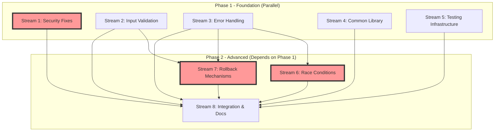

# Implementation Plan - Critical & High Priority Fixes

**Created:** 2025-11-03
**Status:** Ready for Execution
**Approach:** Parallel Agent Implementation
**Estimated Duration:** 3-5 days with 8 parallel agents

---

## Table of Contents

1. [Executive Overview](#executive-overview)
2. [Parallelization Strategy](#parallelization-strategy)
3. [Work Streams](#work-streams)
4. [Task Specifications](#task-specifications)
5. [Dependency Graph](#dependency-graph)
6. [Testing Requirements](#testing-requirements)
7. [Integration Plan](#integration-plan)
8. [Rollout Strategy](#rollout-strategy)

---

## Executive Overview

### Scope

This plan addresses **10 critical/high priority issues** identified in the code review, organized into **8 parallel work streams** for simultaneous execution by multiple agents.

### Goals

- ✅ Eliminate all critical security vulnerabilities
- ✅ Fix race conditions and non-atomic operations
- ✅ Implement comprehensive error handling
- ✅ Add robust input validation
- ✅ Create rollback mechanisms
- ✅ Establish testing infrastructure
- ✅ Maintain backward compatibility
- ✅ Zero downtime for existing users

### Success Metrics

- All critical vulnerabilities resolved (3/3)
- All high priority issues resolved (7/7)
- Test coverage > 80% for modified code
- Zero regressions in existing functionality
- All tests passing in CI/CD pipeline

---

## Parallelization Strategy

### Work Stream Organization

```
┌─────────────────────────────────────────────────────────────┐
│                    PHASE 1: FOUNDATION                      │
│                    (Parallel Execution)                     │
├──────────┬──────────┬──────────┬──────────┬────────────────┤
│ Stream 1 │ Stream 2 │ Stream 3 │ Stream 4 │   Stream 5     │
│ Security │  Input   │  Error   │  Common  │   Testing      │
│  Fixes   │Validation│ Handling │  Library │Infrastructure  │
└──────────┴──────────┴──────────┴──────────┴────────────────┘
                            ↓
┌─────────────────────────────────────────────────────────────┐
│                    PHASE 2: ADVANCED                        │
│              (Depends on Phase 1 completion)                │
├──────────┬──────────┬──────────────────────────────────────┤
│ Stream 6 │ Stream 7 │          Stream 8                    │
│   Race   │ Rollback │       Integration                    │
│Conditions│Mechanisms│      & Documentation                 │
└──────────┴──────────┴──────────────────────────────────────┘
```

### File Ownership Matrix

To prevent merge conflicts, each work stream has clear file ownership:

| Stream | Primary Files | Secondary Files |
|--------|--------------|-----------------|
| Stream 1 | zfs-auto-datasets-ubuntu.sh | zfs-config.sh |
| Stream 2 | lib/zfs-validation.sh (new) | zfs-config.sh |
| Stream 3 | lib/zfs-error-handling.sh (new) | All scripts |
| Stream 4 | lib/zfs-common.sh (new) | - |
| Stream 5 | tests/* (new) | .github/workflows/* |
| Stream 6 | zfs-auto-datasets-ubuntu.sh | zfs-replications-ubuntu.sh |
| Stream 7 | lib/zfs-transactions.sh (new) | zfs-auto-datasets-ubuntu.sh |
| Stream 8 | All documentation | - |

### Coordination Protocol

1. **Branch Strategy:** Each stream works on `feature/stream-N-description`
2. **Daily Sync:** All agents report status at 00:00 UTC
3. **Conflict Resolution:** Stream 8 handles integration conflicts
4. **Code Review:** Cross-stream review before merge
5. **Integration Branch:** `integration/critical-fixes` for Phase 1, Phase 2

---

## Work Streams

### PHASE 1: Foundation (Parallel Execution)

#### Stream 1: Security Vulnerabilities (CRITICAL)
**Agent:** Security Specialist
**Priority:** P0 (Highest)
**Duration:** 2 days
**Dependencies:** None

**Deliverables:**
- Fix command injection in grep patterns
- Fix unsafe rm operations
- Fix cron job manipulation vulnerabilities
- Security testing suite

#### Stream 2: Input Validation (HIGH)
**Agent:** Validation Specialist
**Priority:** P1
**Duration:** 2 days
**Dependencies:** None

**Deliverables:**
- Input validation library
- Dataset name validation
- Path validation
- Numeric value validation
- Integration into all scripts

#### Stream 3: Error Handling (HIGH)
**Agent:** Reliability Specialist
**Priority:** P1
**Duration:** 2 days
**Dependencies:** None

**Deliverables:**
- Error handling library
- Return code checking
- Error recovery mechanisms
- Comprehensive logging

#### Stream 4: Common Library (HIGH)
**Agent:** Architecture Specialist
**Priority:** P1
**Duration:** 2 days
**Dependencies:** None

**Deliverables:**
- Shared function library
- Remove code duplication
- Standardized interfaces
- Documentation

#### Stream 5: Testing Infrastructure (HIGH)
**Agent:** Testing Specialist
**Priority:** P1
**Duration:** 3 days
**Dependencies:** None

**Deliverables:**
- BATS test framework setup
- CI/CD pipeline
- Unit test suite
- Integration test suite
- Test documentation

### PHASE 2: Advanced (Sequential/Parallel)

#### Stream 6: Race Conditions (CRITICAL)
**Agent:** Concurrency Specialist
**Priority:** P0
**Duration:** 2 days
**Dependencies:** Stream 3 (Error Handling)

**Deliverables:**
- Docker container locking mechanism
- VM state verification
- Timeout improvements
- Concurrent operation handling

#### Stream 7: Rollback Mechanisms (CRITICAL)
**Agent:** Transaction Specialist
**Priority:** P0
**Duration:** 3 days
**Dependencies:** Stream 2 (Validation), Stream 3 (Error Handling)

**Deliverables:**
- Transaction state tracking
- Recovery functions
- Rollback procedures
- State file management

#### Stream 8: Integration & Documentation (HIGH)
**Agent:** Integration Specialist
**Priority:** P1
**Duration:** 4 days (spans both phases)
**Dependencies:** All other streams

**Deliverables:**
- Integrate all changes
- Resolve conflicts
- Update documentation
- Migration guide
- Release notes

---

## Task Specifications

### Stream 1: Security Vulnerabilities

#### Task 1.1: Fix Command Injection in Grep Patterns
**File:** `zfs-auto-datasets-ubuntu.sh`
**Lines:** 144, 390, 536, 553
**Priority:** P0 (CRITICAL)

**Current Code (Line 144):**
```bash
if zfs list -H -o mounted,mountpoint | grep -q "^yes"$'\t'"$location$"; then
```

**Issues:**
- `$location` not escaped, allows regex injection
- Could match unintended paths
- Security risk if location controlled by attacker

**Implementation:**
```bash
# Replace all grep patterns with safe alternatives

# Option 1: Use grep -F (fixed string)
if zfs list -H -o mounted,mountpoint | grep -qF "yes	$location"; then

# Option 2: Use zfs list directly (preferred)
is_zfs_dataset() {
    local location="$1"

    # Validate input first
    if ! validate_path "$location"; then
        log_message "ERROR" "Invalid location path: $location"
        return 1
    fi

    # Use ZFS native filtering instead of grep
    if zfs list -H -o name,mountpoint "$location" 2>/dev/null | grep -qF "$location"; then
        return 0
    else
        return 1
    fi
}
```

**Test Cases:**
```bash
# tests/test-security.bats

@test "is_zfs_dataset rejects regex injection" {
    run is_zfs_dataset "/mnt/.*"
    [ "$status" -eq 1 ]
}

@test "is_zfs_dataset rejects path traversal" {
    run is_zfs_dataset "/mnt/../etc/passwd"
    [ "$status" -eq 1 ]
}

@test "is_zfs_dataset accepts valid paths" {
    run is_zfs_dataset "/mnt/tank/data"
    [ "$status" -eq 0 ]
}
```

**Acceptance Criteria:**
- [ ] All grep patterns use -F or -E with proper escaping
- [ ] Input validation before grep operations
- [ ] Test suite covers injection attempts
- [ ] No regex special characters in unquoted variables
- [ ] ShellCheck passes with no warnings

---

#### Task 1.2: Fix Unsafe Path Operations
**File:** `zfs-auto-datasets-ubuntu.sh`
**Lines:** 421, 450, 467
**Priority:** P0 (CRITICAL)

**Current Code (Line 450):**
```bash
rm -rf "${full_source_path}/${normalized_base_entry}_temp"
```

**Issues:**
- If `normalized_base_entry` is empty, deletes entire `full_source_path`
- If contains `..`, could escape directory
- No validation before destructive operation

**Implementation:**
```bash
# Safe path deletion function
safe_remove_directory() {
    local base_path="$1"
    local relative_path="$2"
    local full_path="${base_path}/${relative_path}"

    # Validation checks
    if [[ -z "$relative_path" ]]; then
        log_message "ERROR" "Cannot remove directory: relative path is empty"
        return 1
    fi

    if [[ "$relative_path" =~ \.\. ]]; then
        log_message "ERROR" "Cannot remove directory: path contains .."
        return 1
    fi

    if [[ "$relative_path" =~ ^/ ]]; then
        log_message "ERROR" "Cannot remove directory: relative path starts with /"
        return 1
    fi

    # Verify the path is within base_path
    local real_full_path
    if ! real_full_path=$(realpath -m "$full_path" 2>/dev/null); then
        log_message "ERROR" "Cannot resolve path: $full_path"
        return 1
    fi

    local real_base_path
    if ! real_base_path=$(realpath -m "$base_path" 2>/dev/null); then
        log_message "ERROR" "Cannot resolve base path: $base_path"
        return 1
    fi

    if [[ ! "$real_full_path" =~ ^"$real_base_path"/ ]]; then
        log_message "ERROR" "Path $full_path is outside base path $base_path"
        return 1
    fi

    # Verify directory exists
    if [[ ! -d "$full_path" ]]; then
        log_message "WARNING" "Directory does not exist: $full_path"
        return 0  # Not an error if already gone
    fi

    # Perform deletion with logging
    log_message "INFO" "Removing directory: $full_path"
    if [[ "$DRY_RUN" != "yes" ]]; then
        if ! rm -rf "$full_path"; then
            log_message "ERROR" "Failed to remove directory: $full_path"
            return 1
        fi
        log_message "SUCCESS" "Directory removed: $full_path"
    else
        log_message "INFO" "DRY RUN: Would remove directory: $full_path"
    fi

    return 0
}

# Replace all rm -rf calls
# Before:
# rm -rf "${full_source_path}/${normalized_base_entry}_temp"

# After:
if ! safe_remove_directory "$full_source_path" "${normalized_base_entry}_temp"; then
    log_message "ERROR" "Failed to cleanup temporary directory"
    # Don't fail the whole operation, just log
fi
```

**Test Cases:**
```bash
@test "safe_remove_directory rejects empty path" {
    run safe_remove_directory "/mnt/tank" ""
    [ "$status" -eq 1 ]
    [[ "$output" =~ "relative path is empty" ]]
}

@test "safe_remove_directory rejects path traversal" {
    run safe_remove_directory "/mnt/tank" "../etc"
    [ "$status" -eq 1 ]
    [[ "$output" =~ "path contains .." ]]
}

@test "safe_remove_directory rejects absolute paths" {
    run safe_remove_directory "/mnt/tank" "/etc/passwd"
    [ "$status" -eq 1 ]
    [[ "$output" =~ "starts with /" ]]
}

@test "safe_remove_directory removes valid directory" {
    mkdir -p "/tmp/test-base/test-dir"
    run safe_remove_directory "/tmp/test-base" "test-dir"
    [ "$status" -eq 0 ]
    [ ! -d "/tmp/test-base/test-dir" ]
}
```

**Acceptance Criteria:**
- [ ] All rm -rf operations use safe_remove_directory
- [ ] Path validation prevents traversal attacks
- [ ] Empty path handling prevents accidents
- [ ] Realpath verification ensures containment
- [ ] Test suite covers all edge cases

---

#### Task 1.3: Fix Cron Job Manipulation
**File:** `zfs-config.sh`
**Lines:** 201, 242
**Priority:** P0 (CRITICAL)

**Current Code (Line 201):**
```bash
grep -v "$dataset_script\|$replication_script" "$temp_crontab" > "${temp_crontab}.new"
```

**Issues:**
- Unquoted variables in grep pattern
- Could match partial paths
- Pipe character allows OR matching unintended entries

**Implementation:**
```bash
# Safe cron job manipulation
remove_cron_entries() {
    local script1="$1"
    local script2="$2"
    local temp_crontab="$3"

    # Validate inputs
    if [[ -z "$script1" || -z "$script2" || -z "$temp_crontab" ]]; then
        log_message "ERROR" "remove_cron_entries: missing required parameters"
        return 1
    fi

    if [[ ! -f "$temp_crontab" ]]; then
        log_message "ERROR" "Crontab file does not exist: $temp_crontab"
        return 1
    fi

    # Use fixed string matching with separate -e options
    if ! grep -vF -e "$script1" -e "$script2" "$temp_crontab" > "${temp_crontab}.new"; then
        # grep -v returns 1 if no lines matched (all lines filtered out)
        # This is actually success for us
        : # No-op, continue
    fi

    # Verify the new file was created
    if [[ ! -f "${temp_crontab}.new" ]]; then
        log_message "ERROR" "Failed to create new crontab file"
        return 1
    fi

    return 0
}

# Update setup_cron_jobs function
setup_cron_jobs() {
    if [[ "$ENABLE_SCHEDULING" != "yes" ]]; then
        echo "Scheduling disabled - skipping cron job setup"
        return 0
    fi

    # Validate script paths
    local script_dir="$(cd "$(dirname "${BASH_SOURCE[0]}")" && pwd)"
    local dataset_script="$script_dir/zfs-auto-datasets-ubuntu.sh"
    local replication_script="$script_dir/zfs-replications-ubuntu.sh"

    # Verify scripts exist and are executable
    if [[ ! -f "$dataset_script" ]]; then
        echo "ERROR: Dataset converter script not found: $dataset_script" >&2
        return 1
    fi

    if [[ ! -x "$dataset_script" ]]; then
        echo "ERROR: Dataset converter script not executable: $dataset_script" >&2
        return 1
    fi

    if [[ ! -f "$replication_script" ]]; then
        echo "ERROR: Replication script not found: $replication_script" >&2
        return 1
    fi

    if [[ ! -x "$replication_script" ]]; then
        echo "ERROR: Replication script not executable: $replication_script" >&2
        return 1
    fi

    # Create temporary crontab file with secure permissions
    local temp_crontab
    if ! temp_crontab=$(mktemp); then
        echo "ERROR: Failed to create temporary file" >&2
        return 1
    fi
    chmod 600 "$temp_crontab"

    # Get existing crontab (ignore errors if no crontab exists)
    crontab -l 2>/dev/null > "$temp_crontab" || true

    # Remove existing entries for these scripts
    if ! remove_cron_entries "$dataset_script" "$replication_script" "$temp_crontab"; then
        rm -f "$temp_crontab" "${temp_crontab}.new"
        return 1
    fi

    mv "${temp_crontab}.new" "$temp_crontab"

    # Validate cron schedule format
    if ! validate_cron_schedule "$DATASET_CONVERTER_SCHEDULE"; then
        echo "ERROR: Invalid cron schedule: $DATASET_CONVERTER_SCHEDULE" >&2
        rm -f "$temp_crontab"
        return 1
    fi

    if ! validate_cron_schedule "$REPLICATION_SCHEDULE"; then
        echo "ERROR: Invalid cron schedule: $REPLICATION_SCHEDULE" >&2
        rm -f "$temp_crontab"
        return 1
    fi

    # Add new cron entries with proper escaping
    {
        echo "# ZFS Auto Dataset Converter - Generated by zfs-config.sh"
        echo "$DATASET_CONVERTER_SCHEDULE $(printf '%q' "$dataset_script") >/dev/null 2>&1"
        echo ""
        echo "# ZFS Snapshot & Replication - Generated by zfs-config.sh"
        echo "$REPLICATION_SCHEDULE $(printf '%q' "$replication_script") >/dev/null 2>&1"
        echo ""
    } >> "$temp_crontab"

    # Install the new crontab
    if crontab "$temp_crontab"; then
        echo "SUCCESS: Cron jobs installed successfully"
        echo "  Dataset Converter: $DATASET_CONVERTER_SCHEDULE"
        echo "  Snapshot & Replication: $REPLICATION_SCHEDULE"
        echo ""
        echo "View scheduled jobs with: crontab -l"
    else
        echo "ERROR: Failed to install cron jobs" >&2
        rm -f "$temp_crontab"
        return 1
    fi

    # Clean up
    rm -f "$temp_crontab"
}

# Add cron schedule validation
validate_cron_schedule() {
    local schedule="$1"

    # Basic validation: should have 5 fields (minute hour day month weekday)
    local field_count=$(echo "$schedule" | awk '{print NF}')
    if [[ "$field_count" -ne 5 ]]; then
        echo "ERROR: Cron schedule must have 5 fields, got $field_count" >&2
        return 1
    fi

    # Each field should only contain valid cron characters
    if [[ ! "$schedule" =~ ^[0-9*/,-\ ]+$ ]]; then
        echo "ERROR: Cron schedule contains invalid characters" >&2
        return 1
    fi

    return 0
}
```

**Test Cases:**
```bash
@test "remove_cron_entries removes exact matches" {
    echo "0 2 * * * /opt/zfs-scripts/zfs-auto-datasets-ubuntu.sh" > "$BATS_TMPDIR/test-cron"
    echo "0 3 * * * /opt/zfs-scripts/zfs-replications-ubuntu.sh" >> "$BATS_TMPDIR/test-cron"
    echo "0 4 * * * /other/script.sh" >> "$BATS_TMPDIR/test-cron"

    run remove_cron_entries \
        "/opt/zfs-scripts/zfs-auto-datasets-ubuntu.sh" \
        "/opt/zfs-scripts/zfs-replications-ubuntu.sh" \
        "$BATS_TMPDIR/test-cron"

    [ "$status" -eq 0 ]
    [ $(cat "${BATS_TMPDIR}/test-cron.new" | wc -l) -eq 1 ]
    grep -q "/other/script.sh" "${BATS_TMPDIR}/test-cron.new"
}

@test "validate_cron_schedule accepts valid schedules" {
    run validate_cron_schedule "0 2 * * *"
    [ "$status" -eq 0 ]

    run validate_cron_schedule "*/5 * * * *"
    [ "$status" -eq 0 ]

    run validate_cron_schedule "0 0 1 * 0"
    [ "$status" -eq 0 ]
}

@test "validate_cron_schedule rejects invalid schedules" {
    run validate_cron_schedule "invalid"
    [ "$status" -eq 1 ]

    run validate_cron_schedule "0 2 * *"
    [ "$status" -eq 1 ]

    run validate_cron_schedule "0 2 * * * *"
    [ "$status" -eq 1 ]
}
```

**Acceptance Criteria:**
- [ ] All cron operations use safe_remove_directory
- [ ] Fixed string matching with -F
- [ ] Cron schedule validation
- [ ] Script path validation
- [ ] Test suite covers edge cases

---

### Stream 2: Input Validation

#### Task 2.1: Create Validation Library
**File:** `lib/zfs-validation.sh` (NEW)
**Priority:** P1

**Implementation:**
```bash
#!/bin/bash
# # # # # # # # # # # # # # # # # # # # # # # # # # # # # # # # # # # # # # # #
# #   ZFS Input Validation Library                                          # #
# #   Provides comprehensive input validation functions for ZFS scripts    # #
# # # # # # # # # # # # # # # # # # # # # # # # # # # # # # # # # # # # # # # #

# Source error handling library if not already loaded
if ! declare -F log_message >/dev/null 2>&1; then
    echo "ERROR: zfs-validation.sh requires zfs-common.sh or zfs-error-handling.sh" >&2
    exit 1
fi

#######################################
# Validate ZFS dataset name
# Globals:
#   None
# Arguments:
#   $1 - Dataset name to validate
# Returns:
#   0 on valid, 1 on invalid
# Outputs:
#   Error message to stderr if invalid
#######################################
validate_dataset_name() {
    local name="$1"

    if [[ -z "$name" ]]; then
        echo "ERROR: Dataset name cannot be empty" >&2
        return 1
    fi

    # ZFS dataset names can contain:
    # - Alphanumeric characters
    # - Underscores, hyphens, colons, periods
    # - Forward slashes for hierarchy
    # Cannot start with hyphen
    # Cannot have consecutive slashes
    # Cannot end with slash

    if [[ ! "$name" =~ ^[a-zA-Z0-9][a-zA-Z0-9_:.-]*(\/[a-zA-Z0-9][a-zA-Z0-9_:.-]*)*$ ]]; then
        echo "ERROR: Invalid dataset name format: $name" >&2
        echo "Dataset names must start with alphanumeric, and contain only [a-zA-Z0-9_:.-/]" >&2
        return 1
    fi

    if [[ "$name" =~ // ]]; then
        echo "ERROR: Dataset name cannot contain consecutive slashes: $name" >&2
        return 1
    fi

    if [[ "$name" =~ /$ ]]; then
        echo "ERROR: Dataset name cannot end with slash: $name" >&2
        return 1
    fi

    # Check for ZFS reserved names
    local basename="${name##*/}"
    case "$basename" in
        ".zfs"|"snapshot"|"bookmark")
            echo "ERROR: Dataset name uses ZFS reserved word: $basename" >&2
            return 1
            ;;
    esac

    # Check length (ZFS has a max path length)
    if [[ ${#name} -gt 255 ]]; then
        echo "ERROR: Dataset name too long (max 255 characters): ${#name}" >&2
        return 1
    fi

    return 0
}

#######################################
# Validate filesystem path
# Globals:
#   None
# Arguments:
#   $1 - Path to validate
#   $2 - Base path (optional, for relative path validation)
# Returns:
#   0 on valid, 1 on invalid
#######################################
validate_path() {
    local path="$1"
    local base_path="${2:-}"

    if [[ -z "$path" ]]; then
        echo "ERROR: Path cannot be empty" >&2
        return 1
    fi

    # Check for path traversal attempts
    if [[ "$path" =~ \.\. ]]; then
        echo "ERROR: Path contains parent directory reference (..): $path" >&2
        return 1
    fi

    # Check for null bytes
    if [[ "$path" =~ $'\0' ]]; then
        echo "ERROR: Path contains null byte" >&2
        return 1
    fi

    # Check for control characters
    if [[ "$path" =~ [[:cntrl:]] ]]; then
        echo "ERROR: Path contains control characters: $path" >&2
        return 1
    fi

    # If base path provided, ensure path is within it
    if [[ -n "$base_path" ]]; then
        local real_path
        local real_base

        # Use realpath -m to resolve without requiring existence
        if ! real_path=$(realpath -m "$path" 2>/dev/null); then
            echo "ERROR: Cannot resolve path: $path" >&2
            return 1
        fi

        if ! real_base=$(realpath -m "$base_path" 2>/dev/null); then
            echo "ERROR: Cannot resolve base path: $base_path" >&2
            return 1
        fi

        if [[ ! "$real_path" =~ ^"$real_base"(/|$) ]]; then
            echo "ERROR: Path $path is outside base path $base_path" >&2
            return 1
        fi
    fi

    return 0
}

#######################################
# Validate positive integer
# Arguments:
#   $1 - Value to validate
#   $2 - Variable name (for error messages)
# Returns:
#   0 on valid, 1 on invalid
#######################################
validate_positive_integer() {
    local value="$1"
    local name="${2:-value}"

    if [[ ! "$value" =~ ^[0-9]+$ ]]; then
        echo "ERROR: $name must be a positive integer, got: $value" >&2
        return 1
    fi

    if [[ "$value" -eq 0 ]]; then
        echo "ERROR: $name must be greater than 0" >&2
        return 1
    fi

    return 0
}

#######################################
# Validate non-negative integer
# Arguments:
#   $1 - Value to validate
#   $2 - Variable name (for error messages)
# Returns:
#   0 on valid, 1 on invalid
#######################################
validate_non_negative_integer() {
    local value="$1"
    local name="${2:-value}"

    if [[ ! "$value" =~ ^[0-9]+$ ]]; then
        echo "ERROR: $name must be a non-negative integer, got: $value" >&2
        return 1
    fi

    return 0
}

#######################################
# Validate integer in range
# Arguments:
#   $1 - Value to validate
#   $2 - Minimum value (inclusive)
#   $3 - Maximum value (inclusive)
#   $4 - Variable name (for error messages)
# Returns:
#   0 on valid, 1 on invalid
#######################################
validate_integer_range() {
    local value="$1"
    local min="$2"
    local max="$3"
    local name="${4:-value}"

    if ! validate_non_negative_integer "$value" "$name"; then
        return 1
    fi

    if [[ "$value" -lt "$min" || "$value" -gt "$max" ]]; then
        echo "ERROR: $name must be between $min and $max, got: $value" >&2
        return 1
    fi

    return 0
}

#######################################
# Validate URL format
# Arguments:
#   $1 - URL to validate
# Returns:
#   0 on valid, 1 on invalid
#######################################
validate_url() {
    local url="$1"

    if [[ -z "$url" ]]; then
        echo "ERROR: URL cannot be empty" >&2
        return 1
    fi

    # Basic URL validation: protocol://host[:port][/path]
    if [[ ! "$url" =~ ^https?://[a-zA-Z0-9]([a-zA-Z0-9-]{0,61}[a-zA-Z0-9])?(\.[a-zA-Z0-9]([a-zA-Z0-9-]{0,61}[a-zA-Z0-9])?)*(:[0-9]{1,5})?(/.*)?$ ]]; then
        echo "ERROR: Invalid URL format: $url" >&2
        return 1
    fi

    # Check for common issues
    if [[ "$url" =~ \ ]]; then
        echo "ERROR: URL contains spaces: $url" >&2
        return 1
    fi

    if [[ "$url" =~ \.\./ ]]; then
        echo "ERROR: URL contains path traversal: $url" >&2
        return 1
    fi

    return 0
}

#######################################
# Validate hostname or IP address
# Arguments:
#   $1 - Host to validate
# Returns:
#   0 on valid, 1 on invalid
#######################################
validate_host() {
    local host="$1"

    if [[ -z "$host" ]]; then
        echo "ERROR: Host cannot be empty" >&2
        return 1
    fi

    # Check if it's an IPv4 address
    if [[ "$host" =~ ^[0-9]{1,3}\.[0-9]{1,3}\.[0-9]{1,3}\.[0-9]{1,3}$ ]]; then
        # Validate each octet
        local IFS='.'
        local -a octets=($host)
        for octet in "${octets[@]}"; do
            if [[ "$octet" -gt 255 ]]; then
                echo "ERROR: Invalid IPv4 address: $host" >&2
                return 1
            fi
        done
        return 0
    fi

    # Check if it's a hostname
    if [[ "$host" =~ ^[a-zA-Z0-9]([a-zA-Z0-9-]{0,61}[a-zA-Z0-9])?(\.[a-zA-Z0-9]([a-zA-Z0-9-]{0,61}[a-zA-Z0-9])?)*$ ]]; then
        return 0
    fi

    echo "ERROR: Invalid hostname or IP address: $host" >&2
    return 1
}

#######################################
# Validate ZFS pool exists
# Arguments:
#   $1 - Pool name
# Returns:
#   0 if exists, 1 if not
#######################################
validate_pool_exists() {
    local pool="$1"

    if ! validate_dataset_name "$pool"; then
        return 1
    fi

    if ! zpool list -H "$pool" &>/dev/null; then
        echo "ERROR: ZFS pool does not exist: $pool" >&2
        return 1
    fi

    return 0
}

#######################################
# Validate ZFS dataset exists
# Arguments:
#   $1 - Dataset name
# Returns:
#   0 if exists, 1 if not
#######################################
validate_dataset_exists() {
    local dataset="$1"

    if ! validate_dataset_name "$dataset"; then
        return 1
    fi

    if ! zfs list -H "$dataset" &>/dev/null; then
        echo "ERROR: ZFS dataset does not exist: $dataset" >&2
        return 1
    fi

    return 0
}

#######################################
# Validate ZFS snapshot name format
# Arguments:
#   $1 - Snapshot name (dataset@snapshot)
# Returns:
#   0 on valid, 1 on invalid
#######################################
validate_snapshot_name() {
    local snapshot="$1"

    if [[ ! "$snapshot" =~ ^(.+)@([^@]+)$ ]]; then
        echo "ERROR: Invalid snapshot format, expected dataset@snapshot: $snapshot" >&2
        return 1
    fi

    local dataset="${BASH_REMATCH[1]}"
    local snap="${BASH_REMATCH[2]}"

    if ! validate_dataset_name "$dataset"; then
        return 1
    fi

    # Snapshot names have similar rules but no slashes
    if [[ ! "$snap" =~ ^[a-zA-Z0-9][a-zA-Z0-9_:.-]*$ ]]; then
        echo "ERROR: Invalid snapshot name format: $snap" >&2
        return 1
    fi

    return 0
}

# Export validation functions
export -f validate_dataset_name
export -f validate_path
export -f validate_positive_integer
export -f validate_non_negative_integer
export -f validate_integer_range
export -f validate_url
export -f validate_host
export -f validate_pool_exists
export -f validate_dataset_exists
export -f validate_snapshot_name
```

**Test Cases:**
```bash
# tests/test-validation.bats

@test "validate_dataset_name accepts valid names" {
    source lib/zfs-validation.sh

    run validate_dataset_name "tank"
    [ "$status" -eq 0 ]

    run validate_dataset_name "tank/data"
    [ "$status" -eq 0 ]

    run validate_dataset_name "pool_01"
    [ "$status" -eq 0 ]

    run validate_dataset_name "my-pool"
    [ "$status" -eq 0 ]

    run validate_dataset_name "pool:backup"
    [ "$status" -eq 0 ]
}

@test "validate_dataset_name rejects invalid names" {
    source lib/zfs-validation.sh

    run validate_dataset_name ""
    [ "$status" -eq 1 ]

    run validate_dataset_name "../etc"
    [ "$status" -eq 1 ]

    run validate_dataset_name "tank//data"
    [ "$status" -eq 1 ]

    run validate_dataset_name "tank/data/"
    [ "$status" -eq 1 ]

    run validate_dataset_name "-badname"
    [ "$status" -eq 1 ]

    run validate_dataset_name "tank/.zfs"
    [ "$status" -eq 1 ]
}

@test "validate_path rejects traversal" {
    source lib/zfs-validation.sh

    run validate_path "/mnt/../etc/passwd"
    [ "$status" -eq 1 ]

    run validate_path "../../secret"
    [ "$status" -eq 1 ]
}

@test "validate_path with base path containment" {
    source lib/zfs-validation.sh

    run validate_path "/mnt/tank/data/subdir" "/mnt/tank"
    [ "$status" -eq 0 ]

    run validate_path "/etc/passwd" "/mnt/tank"
    [ "$status" -eq 1 ]
}

@test "validate_positive_integer accepts valid integers" {
    source lib/zfs-validation.sh

    run validate_positive_integer "1" "test"
    [ "$status" -eq 0 ]

    run validate_positive_integer "100" "test"
    [ "$status" -eq 0 ]
}

@test "validate_positive_integer rejects invalid values" {
    source lib/zfs-validation.sh

    run validate_positive_integer "0" "test"
    [ "$status" -eq 1 ]

    run validate_positive_integer "-1" "test"
    [ "$status" -eq 1 ]

    run validate_positive_integer "abc" "test"
    [ "$status" -eq 1 ]

    run validate_positive_integer "1.5" "test"
    [ "$status" -eq 1 ]
}

@test "validate_integer_range validates ranges" {
    source lib/zfs-validation.sh

    run validate_integer_range "50" "0" "100" "percent"
    [ "$status" -eq 0 ]

    run validate_integer_range "150" "0" "100" "percent"
    [ "$status" -eq 1 ]
}

@test "validate_url accepts valid URLs" {
    source lib/zfs-validation.sh

    run validate_url "http://localhost:8080"
    [ "$status" -eq 0 ]

    run validate_url "https://example.com/path"
    [ "$status" -eq 0 ]
}

@test "validate_url rejects invalid URLs" {
    source lib/zfs-validation.sh

    run validate_url "not a url"
    [ "$status" -eq 1 ]

    run validate_url "http://bad url.com"
    [ "$status" -eq 1 ]
}

@test "validate_host accepts valid hosts" {
    source lib/zfs-validation.sh

    run validate_host "192.168.1.1"
    [ "$status" -eq 0 ]

    run validate_host "example.com"
    [ "$status" -eq 0 ]

    run validate_host "my-server.local"
    [ "$status" -eq 0 ]
}

@test "validate_host rejects invalid hosts" {
    source lib/zfs-validation.sh

    run validate_host "999.999.999.999"
    [ "$status" -eq 1 ]

    run validate_host "bad_host!"
    [ "$status" -eq 1 ]
}
```

**Acceptance Criteria:**
- [ ] All validation functions implemented
- [ ] Comprehensive test coverage (>90%)
- [ ] Documentation for each function
- [ ] Integration examples provided
- [ ] No external dependencies

---

#### Task 2.2: Integrate Validation into zfs-config.sh
**File:** `zfs-config.sh`
**Priority:** P1

**Implementation:**
```bash
# Add after sourcing section
if [[ -f "$SCRIPT_DIR/lib/zfs-validation.sh" ]]; then
    source "$SCRIPT_DIR/lib/zfs-validation.sh"
else
    echo "ERROR: Cannot find lib/zfs-validation.sh" >&2
    exit 1
fi

# Enhanced validate_config function
validate_config() {
    local errors=0

    log_message "INFO" "Validating configuration..."

    # Validate pool and dataset names
    if ! validate_dataset_name "$SOURCE_POOL"; then
        errors=$((errors + 1))
    fi

    if ! validate_dataset_name "$SOURCE_DATASET"; then
        errors=$((errors + 1))
    fi

    if [[ "$SHOULD_PROCESS_CONTAINERS" == "yes" ]]; then
        if ! validate_dataset_name "$SOURCE_POOL_APPDATA"; then
            errors=$((errors + 1))
        fi
        if ! validate_dataset_name "$SOURCE_DATASET_APPDATA"; then
            errors=$((errors + 1))
        fi
    fi

    if [[ "$SHOULD_PROCESS_VMS" == "yes" ]]; then
        if ! validate_dataset_name "$SOURCE_POOL_VMS"; then
            errors=$((errors + 1))
        fi
        if ! validate_dataset_name "$SOURCE_DATASET_VMS"; then
            errors=$((errors + 1))
        fi
    fi

    # Validate dataset array
    for dataset in "${SOURCE_DATASETS_ARRAY[@]}"; do
        if ! validate_dataset_name "$dataset"; then
            echo "ERROR: Invalid dataset in SOURCE_DATASETS_ARRAY: $dataset" >&2
            errors=$((errors + 1))
        fi
    done

    # Validate paths
    if ! validate_path "$MOUNT_POINT"; then
        errors=$((errors + 1))
    fi

    local log_dir
    log_dir=$(dirname "$LOG_FILE")
    if ! validate_path "$log_dir"; then
        errors=$((errors + 1))
    fi

    if [[ ! -d "$log_dir" ]]; then
        echo "ERROR: Log directory does not exist: $log_dir" >&2
        errors=$((errors + 1))
    elif [[ ! -w "$log_dir" ]]; then
        echo "ERROR: Log directory is not writable: $log_dir" >&2
        errors=$((errors + 1))
    fi

    # Validate mount point exists
    if [[ ! -d "$MOUNT_POINT" ]]; then
        echo "ERROR: Mount point does not exist: $MOUNT_POINT" >&2
        errors=$((errors + 1))
    fi

    # Validate retention policy values
    if ! validate_non_negative_integer "$SNAPSHOT_HOURS" "SNAPSHOT_HOURS"; then
        errors=$((errors + 1))
    fi

    if ! validate_non_negative_integer "$SNAPSHOT_DAYS" "SNAPSHOT_DAYS"; then
        errors=$((errors + 1))
    fi

    if ! validate_non_negative_integer "$SNAPSHOT_WEEKS" "SNAPSHOT_WEEKS"; then
        errors=$((errors + 1))
    fi

    if ! validate_non_negative_integer "$SNAPSHOT_MONTHS" "SNAPSHOT_MONTHS"; then
        errors=$((errors + 1))
    fi

    if ! validate_non_negative_integer "$SNAPSHOT_YEARS" "SNAPSHOT_YEARS"; then
        errors=$((errors + 1))
    fi

    # Validate buffer zone (0-100 percent)
    if ! validate_integer_range "$BUFFER_ZONE" "0" "100" "BUFFER_ZONE"; then
        errors=$((errors + 1))
    fi

    # Validate VM force shutdown wait
    if ! validate_positive_integer "$VM_FORCE_SHUTDOWN_WAIT" "VM_FORCE_SHUTDOWN_WAIT"; then
        errors=$((errors + 1))
    fi

    # Validate notification settings
    case "$notification_type" in
        "all"|"error"|"none") ;;
        *)
            echo "ERROR: notification_type must be 'all', 'error', or 'none', got: $notification_type" >&2
            errors=$((errors + 1))
            ;;
    esac

    # Validate Gotify settings if notifications enabled
    if [[ "$notification_type" != "none" ]]; then
        if [[ -z "$GOTIFY_SERVER_URL" ]]; then
            echo "ERROR: GOTIFY_SERVER_URL must be set when notifications are enabled" >&2
            errors=$((errors + 1))
        elif ! validate_url "$GOTIFY_SERVER_URL"; then
            errors=$((errors + 1))
        fi

        if [[ -z "$GOTIFY_APP_TOKEN" ]]; then
            echo "ERROR: GOTIFY_APP_TOKEN must be set when notifications are enabled" >&2
            errors=$((errors + 1))
        fi
    fi

    # Validate remote server settings if enabled
    if [[ "$DESTINATION_REMOTE" == "yes" ]]; then
        if [[ -z "$REMOTE_USER" ]]; then
            echo "ERROR: REMOTE_USER must be set when remote destination is enabled" >&2
            errors=$((errors + 1))
        fi

        if [[ -z "$REMOTE_SERVER" ]]; then
            echo "ERROR: REMOTE_SERVER must be set when remote destination is enabled" >&2
            errors=$((errors + 1))
        elif ! validate_host "$REMOTE_SERVER"; then
            errors=$((errors + 1))
        fi
    fi

    # Validate replication settings
    case "$REPLICATION" in
        "zfs")
            if ! validate_dataset_name "$DESTINATION_POOL"; then
                errors=$((errors + 1))
            fi
            if ! validate_dataset_name "$PARENT_DESTINATION_DATASET"; then
                errors=$((errors + 1))
            fi
            case "$SYNCOID_MODE" in
                "strict-mirror"|"basic") ;;
                *)
                    echo "ERROR: SYNCOID_MODE must be 'strict-mirror' or 'basic', got: $SYNCOID_MODE" >&2
                    errors=$((errors + 1))
                    ;;
            esac
            ;;
        "rsync")
            if ! validate_path "$PARENT_DESTINATION_FOLDER"; then
                errors=$((errors + 1))
            fi
            case "$RSYNC_TYPE" in
                "incremental"|"mirror") ;;
                *)
                    echo "ERROR: RSYNC_TYPE must be 'incremental' or 'mirror', got: $RSYNC_TYPE" >&2
                    errors=$((errors + 1))
                    ;;
            esac
            ;;
        "none") ;;
        *)
            echo "ERROR: REPLICATION must be 'zfs', 'rsync', or 'none', got: $REPLICATION" >&2
            errors=$((errors + 1))
            ;;
    esac

    # Validate DRY_RUN setting
    case "$DRY_RUN" in
        "yes"|"no") ;;
        *)
            echo "ERROR: DRY_RUN must be 'yes' or 'no', got: $DRY_RUN" >&2
            errors=$((errors + 1))
            ;;
    esac

    # Validate SHOULD_PROCESS settings
    case "$SHOULD_PROCESS_CONTAINERS" in
        "yes"|"no") ;;
        *)
            echo "ERROR: SHOULD_PROCESS_CONTAINERS must be 'yes' or 'no', got: $SHOULD_PROCESS_CONTAINERS" >&2
            errors=$((errors + 1))
            ;;
    esac

    case "$SHOULD_PROCESS_VMS" in
        "yes"|"no") ;;
        *)
            echo "ERROR: SHOULD_PROCESS_VMS must be 'yes' or 'no', got: $SHOULD_PROCESS_VMS" >&2
            errors=$((errors + 1))
            ;;
    esac

    case "$CLEANUP_TEMP_DIRS" in
        "yes"|"no") ;;
        *)
            echo "ERROR: CLEANUP_TEMP_DIRS must be 'yes' or 'no', got: $CLEANUP_TEMP_DIRS" >&2
            errors=$((errors + 1))
            ;;
    esac

    if [[ $errors -gt 0 ]]; then
        echo "ERROR: Configuration validation failed with $errors error(s)" >&2
        return 1
    fi

    log_message "SUCCESS" "Configuration validation passed"
    return 0
}
```

**Acceptance Criteria:**
- [ ] All configuration values validated
- [ ] Clear error messages for each invalid value
- [ ] validate_config returns non-zero on any error
- [ ] Test suite covers all validation paths

---

### Stream 3: Error Handling

#### Task 3.1: Create Error Handling Library
**File:** `lib/zfs-error-handling.sh` (NEW)
**Priority:** P1

**Implementation:**
```bash
#!/bin/bash
# # # # # # # # # # # # # # # # # # # # # # # # # # # # # # # # # # # # # # # #
# #   ZFS Error Handling Library                                            # #
# #   Provides comprehensive error handling and recovery functions         # #
# # # # # # # # # # # # # # # # # # # # # # # # # # # # # # # # # # # # # # # #

# Enable error tracking
set -o pipefail

# Global error state
declare -g ZFS_ERROR_COUNT=0
declare -g ZFS_LAST_ERROR=""
declare -g ZFS_ERROR_LOG="${ZFS_ERROR_LOG:-/var/log/zfs-errors.log}"

#######################################
# Log error and increment counter
# Globals:
#   ZFS_ERROR_COUNT
#   ZFS_LAST_ERROR
#   ZFS_ERROR_LOG
# Arguments:
#   $1 - Error message
#   $2 - Error code (optional)
# Returns:
#   Error code or 1
#######################################
error() {
    local message="$1"
    local code="${2:-1}"
    local timestamp=$(date '+%Y-%m-%d %H:%M:%S')

    ZFS_ERROR_COUNT=$((ZFS_ERROR_COUNT + 1))
    ZFS_LAST_ERROR="$message"

    # Log to error log file
    echo "[$timestamp] [ERROR $code] $message" >> "$ZFS_ERROR_LOG"

    # Also log via standard logging if available
    if declare -F log_message >/dev/null 2>&1; then
        log_message "ERROR" "$message"
    else
        echo "ERROR: $message" >&2
    fi

    return "$code"
}

#######################################
# Execute command with error handling
# Arguments:
#   $@ - Command and arguments
# Returns:
#   Command exit code
# Outputs:
#   Command output and error on failure
#######################################
safe_execute() {
    local cmd=("$@")
    local output
    local exit_code

    # Execute command and capture output
    if output=$(   "${cmd[@]}" 2>&1); then
        exit_code=0
    else
        exit_code=$?
        error "Command failed (exit $exit_code): ${cmd[*]}" "$exit_code"
        echo "$output" >&2
    fi

    return "$exit_code"
}

#######################################
# Execute command with retry logic
# Arguments:
#   $1 - Max retry attempts
#   $2+ - Command and arguments
# Returns:
#   0 on success, last exit code on failure
#######################################
retry_execute() {
    local max_attempts="$1"
    shift
    local cmd=("$@")
    local attempt=1
    local exit_code

    while (( attempt <= max_attempts )); do
        if "${cmd[@]}"; then
            return 0
        else
            exit_code=$?
            if (( attempt < max_attempts )); then
                local wait_time=$((2 ** (attempt - 1)))  # Exponential backoff
                if declare -F log_message >/dev/null 2>&1; then
                    log_message "WARNING" "Command failed (attempt $attempt/$max_attempts), retrying in ${wait_time}s: ${cmd[*]}"
                fi
                sleep "$wait_time"
            fi
            attempt=$((attempt + 1))
        fi
    done

    error "Command failed after $max_attempts attempts: ${cmd[*]}" "$exit_code"
    return "$exit_code"
}

#######################################
# Check if command succeeded
# Arguments:
#   $1 - Exit code to check
#   $2 - Error message if failed
# Returns:
#   0 if success, 1 if failed
#######################################
check_exit_code() {
    local exit_code="$1"
    local message="$2"

    if [[ "$exit_code" -ne 0 ]]; then
        error "$message (exit code: $exit_code)" "$exit_code"
        return 1
    fi

    return 0
}

#######################################
# Require command to succeed or exit
# Arguments:
#   $@ - Command and arguments
# Returns:
#   Never returns on failure (exits script)
#######################################
require() {
    local cmd=("$@")

    if ! "${cmd[@]}"; then
        local exit_code=$?
        error "FATAL: Required command failed: ${cmd[*]}" "$exit_code"
        exit "$exit_code"
    fi
}

#######################################
# Execute command in dry-run mode
# Globals:
#   DRY_RUN
# Arguments:
#   $@ - Command and arguments
# Returns:
#   0 in dry-run, command exit code otherwise
#######################################
dry_run_execute() {
    local cmd=("$@")

    if [[ "${DRY_RUN:-no}" == "yes" ]]; then
        if declare -F log_message >/dev/null 2>&1; then
            log_message "INFO" "DRY RUN: Would execute: ${cmd[*]}"
        else
            echo "DRY RUN: Would execute: ${cmd[*]}"
        fi
        return 0
    else
        "${cmd[@]}"
        return $?
    fi
}

#######################################
# Verify file exists and is readable
# Arguments:
#   $1 - File path
# Returns:
#   0 if exists and readable, 1 otherwise
#######################################
require_file() {
    local file="$1"

    if [[ ! -f "$file" ]]; then
        error "Required file does not exist: $file"
        return 1
    fi

    if [[ ! -r "$file" ]]; then
        error "Required file is not readable: $file"
        return 1
    fi

    return 0
}

#######################################
# Verify directory exists and is writable
# Arguments:
#   $1 - Directory path
# Returns:
#   0 if exists and writable, 1 otherwise
#######################################
require_directory() {
    local dir="$1"

    if [[ ! -d "$dir" ]]; then
        error "Required directory does not exist: $dir"
        return 1
    fi

    if [[ ! -w "$dir" ]]; then
        error "Required directory is not writable: $dir"
        return 1
    fi

    return 0
}

#######################################
# Verify command exists in PATH
# Arguments:
#   $1 - Command name
# Returns:
#   0 if exists, 1 otherwise
#######################################
require_command() {
    local cmd="$1"

    if ! command -v "$cmd" >/dev/null 2>&1; then
        error "Required command not found: $cmd"
        return 1
    fi

    return 0
}

#######################################
# Cleanup function to call on exit
# Usage: trap cleanup_on_exit EXIT
#######################################
cleanup_on_exit() {
    local exit_code=$?

    if [[ $exit_code -ne 0 ]]; then
        if declare -F log_message >/dev/null 2>&1; then
            log_message "ERROR" "Script exited with error code: $exit_code"
            log_message "ERROR" "Total errors encountered: $ZFS_ERROR_COUNT"
            if [[ -n "$ZFS_LAST_ERROR" ]]; then
                log_message "ERROR" "Last error: $ZFS_LAST_ERROR"
            fi
        fi
    fi

    # Call user-defined cleanup if available
    if declare -F user_cleanup >/dev/null 2>&1; then
        user_cleanup
    fi
}

#######################################
# Reset error counter
#######################################
reset_error_count() {
    ZFS_ERROR_COUNT=0
    ZFS_LAST_ERROR=""
}

#######################################
# Get error count
# Returns:
#   Current error count
#######################################
get_error_count() {
    echo "$ZFS_ERROR_COUNT"
}

#######################################
# Get last error message
# Returns:
#   Last error message
#######################################
get_last_error() {
    echo "$ZFS_LAST_ERROR"
}

# Export error handling functions
export -f error
export -f safe_execute
export -f retry_execute
export -f check_exit_code
export -f require
export -f dry_run_execute
export -f require_file
export -f require_directory
export -f require_command
export -f cleanup_on_exit
export -f reset_error_count
export -f get_error_count
export -f get_last_error

# Set up exit trap
trap cleanup_on_exit EXIT
```

**Test Cases:**
```bash
# tests/test-error-handling.bats

@test "error function logs and increments counter" {
    source lib/zfs-error-handling.sh
    export ZFS_ERROR_LOG="$BATS_TMPDIR/error.log"

    reset_error_count
    error "Test error 1"
    error "Test error 2"

    [ "$(get_error_count)" -eq 2 ]
    [ "$(get_last_error)" = "Test error 2" ]
    grep -q "Test error 1" "$ZFS_ERROR_LOG"
}

@test "safe_execute succeeds on valid command" {
    source lib/zfs-error-handling.sh

    run safe_execute echo "test"
    [ "$status" -eq 0 ]
}

@test "safe_execute fails on invalid command" {
    source lib/zfs-error-handling.sh

    run safe_execute false
    [ "$status" -eq 1 ]
    [ "$(get_error_count)" -gt 0 ]
}

@test "retry_execute retries on failure" {
    source lib/zfs-error-handling.sh

    # Create a script that fails twice then succeeds
    cat > "$BATS_TMPDIR/flaky.sh" <<'EOF'
#!/bin/bash
count_file="/tmp/retry-count"
count=$(cat "$count_file" 2>/dev/null || echo 0)
count=$((count + 1))
echo "$count" > "$count_file"
if [ "$count" -lt 3 ]; then
    exit 1
fi
exit 0
EOF
    chmod +x "$BATS_TMPDIR/flaky.sh"
    rm -f /tmp/retry-count

    run retry_execute 5 "$BATS_TMPDIR/flaky.sh"
    [ "$status" -eq 0 ]
}

@test "require_command detects missing commands" {
    source lib/zfs-error-handling.sh

    run require_command "this-command-does-not-exist"
    [ "$status" -eq 1 ]
}

@test "require_command accepts existing commands" {
    source lib/zfs-error-handling.sh

    run require_command "bash"
    [ "$status" -eq 0 ]
}

@test "dry_run_execute skips in dry-run mode" {
    source lib/zfs-error-handling.sh
    export DRY_RUN="yes"

    # This would fail if executed
    run dry_run_execute rm -rf /nonexistent
    [ "$status" -eq 0 ]
    [[ "$output" =~ "DRY RUN" ]]
}

@test "dry_run_execute executes in normal mode" {
    source lib/zfs-error-handling.sh
    export DRY_RUN="no"

    run dry_run_execute echo "test"
    [ "$status" -eq 0 ]
    [[ "$output" == "test" ]]
}
```

**Acceptance Criteria:**
- [ ] All error handling functions implemented
- [ ] Comprehensive test coverage
- [ ] Error logging works correctly
- [ ] Retry logic with exponential backoff
- [ ] Dry-run mode respected

---

### Stream 4: Common Library

#### Task 4.1: Create Common Function Library
**File:** `lib/zfs-common.sh` (NEW)
**Priority:** P1

**Implementation:**
```bash
#!/bin/bash
# # # # # # # # # # # # # # # # # # # # # # # # # # # # # # # # # # # # # # # #
# #   ZFS Common Function Library                                           # #
# #   Shared functions used across multiple ZFS management scripts         # #
# # # # # # # # # # # # # # # # # # # # # # # # # # # # # # # # # # # # # # # #

# Get the directory where this library is located
ZFS_LIB_DIR="$(cd "$(dirname "${BASH_SOURCE[0]}")" && pwd)"

# Source dependencies
if [[ -f "$ZFS_LIB_DIR/zfs-validation.sh" ]]; then
    source "$ZFS_LIB_DIR/zfs-validation.sh"
fi

if [[ -f "$ZFS_LIB_DIR/zfs-error-handling.sh" ]]; then
    source "$ZFS_LIB_DIR/zfs-error-handling.sh"
fi

#######################################
# Log message with timestamp
# Globals:
#   LOG_FILE
# Arguments:
#   $1 - Level (INFO, WARNING, ERROR, SUCCESS)
#   $2 - Message
# Outputs:
#   Writes to log file and stdout
#######################################
log_message() {
    local level="$1"
    local message="$2"
    local timestamp=$(date '+%Y-%m-%d %H:%M:%S')

    # Validate log file
    if [[ -n "${LOG_FILE:-}" ]]; then
        # Ensure log directory exists
        local log_dir=$(dirname "$LOG_FILE")
        if [[ ! -d "$log_dir" ]]; then
            mkdir -p "$log_dir" 2>/dev/null || true
        fi

        # Write to log file
        echo "[$timestamp] [$level] $message" >> "$LOG_FILE" 2>/dev/null || true
    fi

    # Also print to stdout
    echo "[$level] $message"
}

#######################################
# Rotate log file if it exceeds max size
# Globals:
#   LOG_FILE
#   LOG_MAX_SIZE
#   LOG_MAX_FILES
# Returns:
#   0 on success, 1 on error
#######################################
rotate_log() {
    if [[ -z "${LOG_FILE:-}" || ! -f "$LOG_FILE" ]]; then
        return 0
    fi

    # Get file size
    local file_size
    if command -v stat >/dev/null 2>&1; then
        file_size=$(stat -c%s "$LOG_FILE" 2>/dev/null || echo 0)
    else
        file_size=$(ls -la "$LOG_FILE" 2>/dev/null | awk '{print $5}' || echo 0)
    fi

    # Convert LOG_MAX_SIZE to bytes
    local max_bytes
    case "${LOG_MAX_SIZE:-10M}" in
        *M|*m) max_bytes=$((${LOG_MAX_SIZE%[Mm]} * 1024 * 1024)) ;;
        *K|*k) max_bytes=$((${LOG_MAX_SIZE%[Kk]} * 1024)) ;;
        *G|*g) max_bytes=$((${LOG_MAX_SIZE%[Gg]} * 1024 * 1024 * 1024)) ;;
        *) max_bytes="${LOG_MAX_SIZE:-10485760}" ;;
    esac

    # Check if rotation needed
    if [[ "$file_size" -le "$max_bytes" ]]; then
        return 0
    fi

    log_message "INFO" "Log file size ($file_size bytes) exceeds limit ($max_bytes bytes), rotating logs"

    # Rotate existing log files
    local max_files="${LOG_MAX_FILES:-5}"
    for ((i=max_files-1; i>=1; i--)); do
        if [[ -f "${LOG_FILE}.$i" ]]; then
            mv "${LOG_FILE}.$i" "${LOG_FILE}.$((i+1))" 2>/dev/null || true
        fi
    done

    # Rotate current log
    if mv "$LOG_FILE" "${LOG_FILE}.1" 2>/dev/null; then
        touch "$LOG_FILE"
        chmod 640 "$LOG_FILE" 2>/dev/null || true
        log_message "INFO" "Log rotated - previous log saved as ${LOG_FILE}.1"
        return 0
    else
        echo "ERROR: Failed to rotate log file" >&2
        return 1
    fi
}

#######################################
# Send notification via Gotify
# Globals:
#   GOTIFY_SERVER_URL
#   GOTIFY_APP_TOKEN
#   notification_type
# Arguments:
#   $1 - Message
#   $2 - Level (success|error)
# Returns:
#   0 on success, 1 on error
#######################################
send_notification() {
    local message="$1"
    local level="${2:-info}"

    # Log the message first
    case "$level" in
        "success") log_message "SUCCESS" "$message" ;;
        "error") log_message "ERROR" "$message" ;;
        *) log_message "INFO" "$message" ;;
    esac

    # Check notification settings
    local notif_type="${notification_type:-all}"
    if [[ "$notif_type" == "none" ]]; then
        return 0
    fi

    if [[ "$notif_type" == "error" && "$level" == "success" ]]; then
        return 0
    fi

    # Check if Gotify is configured
    if [[ -z "${GOTIFY_SERVER_URL:-}" || -z "${GOTIFY_APP_TOKEN:-}" ]]; then
        return 0
    fi

    # Validate Gotify URL
    if ! validate_url "$GOTIFY_SERVER_URL" 2>/dev/null; then
        log_message "WARNING" "Invalid Gotify URL, skipping notification"
        return 1
    fi

    # Determine priority
    local priority=5
    local title="ZFS Management"
    case "$level" in
        "success") priority=1 ;;
        "error") priority=8 ;;
    esac

    # Send notification
    if ! curl -s -S -X POST "$GOTIFY_SERVER_URL/message" \
            -H "Content-Type: application/json" \
            -H "X-Gotify-Key: $GOTIFY_APP_TOKEN" \
            -d "{\"title\":\"$title\",\"message\":$(printf '%s' "$message" | jq -Rs .),\"priority\":$priority}" \
            >/dev/null 2>&1; then
        log_message "WARNING" "Failed to send Gotify notification"
        return 1
    fi

    return 0
}

#######################################
# Check if location is a mounted ZFS dataset
# Arguments:
#   $1 - Mount point path
# Returns:
#   0 if ZFS dataset, 1 if not
#######################################
is_zfs_dataset() {
    local location="$1"

    # Validate input
    if ! validate_path "$location" 2>/dev/null; then
        return 1
    fi

    # Check if it's a ZFS dataset mountpoint
    if zfs list -H -o name,mountpoint 2>/dev/null | awk -v loc="$location" '$2 == loc {exit 0} END {exit 1}'; then
        return 0
    else
        return 1
    fi
}

#######################################
# Get ZFS dataset for a given path
# Arguments:
#   $1 - Path
# Outputs:
#   Dataset name if found
# Returns:
#   0 if found, 1 if not
#######################################
get_dataset_for_path() {
    local path="$1"

    # Validate input
    if ! validate_path "$path" 2>/dev/null; then
        return 1
    fi

    # Find matching dataset
    local dataset
    dataset=$(zfs list -H -o name,mountpoint 2>/dev/null | awk -v path="$path" '$2 == path {print $1; exit}')

    if [[ -n "$dataset" ]]; then
        echo "$dataset"
        return 0
    else
        return 1
    fi
}

#######################################
# Normalize German umlauts to ASCII
# Arguments:
#   $1 - String to normalize
# Outputs:
#   Normalized string
#######################################
normalize_name() {
    local original_name="$1"
    local normalized_name

    normalized_name=$(echo "$original_name" |
                     sed 's/ä/ae/g; s/ö/oe/g; s/ü/ue/g;
                          s/Ä/Ae/g; s/Ö/Oe/g; s/Ü/Ue/g;
                          s/ß/ss/g')

    echo "$normalized_name"
}

#######################################
# Format bytes to human-readable size
# Arguments:
#   $1 - Size in bytes
# Outputs:
#   Human-readable size (e.g., "1.5G")
#######################################
format_bytes() {
    local bytes="$1"

    if [[ ! "$bytes" =~ ^[0-9]+$ ]]; then
        echo "0B"
        return
    fi

    local units=("B" "K" "M" "G" "T" "P")
    local unit=0
    local size=$bytes

    while (( size >= 1024 && unit < 5 )); do
        size=$((size / 1024))
        unit=$((unit + 1))
    done

    echo "${size}${units[$unit]}"
}

#######################################
# Parse size string to bytes
# Arguments:
#   $1 - Size string (e.g., "10M", "1G")
# Outputs:
#   Size in bytes
#######################################
parse_size_to_bytes() {
    local size_str="$1"

    case "$size_str" in
        *B|*b) echo "${size_str%[Bb]}" ;;
        *K|*k) echo "$((${size_str%[Kk]} * 1024))" ;;
        *M|*m) echo "$((${size_str%[Mm]} * 1024 * 1024))" ;;
        *G|*g) echo "$((${size_str%[Gg]} * 1024 * 1024 * 1024))" ;;
        *T|*t) echo "$((${size_str%[Tt]} * 1024 * 1024 * 1024 * 1024))" ;;
        *) echo "$size_str" ;;
    esac
}

#######################################
# Check if running as root
# Returns:
#   0 if root, 1 if not
#######################################
require_root() {
    if [[ $EUID -ne 0 ]]; then
        error "This script must be run as root"
        return 1
    fi
    return 0
}

#######################################
# Create directory with parents if needed
# Arguments:
#   $1 - Directory path
#   $2 - Permissions (optional, default 755)
# Returns:
#   0 on success, 1 on error
#######################################
ensure_directory() {
    local dir="$1"
    local perms="${2:-755}"

    if [[ -d "$dir" ]]; then
        return 0
    fi

    if mkdir -p "$dir" 2>/dev/null; then
        chmod "$perms" "$dir" 2>/dev/null || true
        log_message "INFO" "Created directory: $dir"
        return 0
    else
        error "Failed to create directory: $dir"
        return 1
    fi
}

#######################################
# Get available space for ZFS dataset
# Arguments:
#   $1 - Dataset name
# Outputs:
#   Available space in bytes
# Returns:
#   0 on success, 1 on error
#######################################
get_dataset_available_space() {
    local dataset="$1"

    if ! validate_dataset_exists "$dataset" 2>/dev/null; then
        return 1
    fi

    local avail
    avail=$(zfs list -H -o avail -p "$dataset" 2>/dev/null)

    if [[ -n "$avail" ]]; then
        echo "$avail"
        return 0
    else
        return 1
    fi
}

#######################################
# Get used space for ZFS dataset
# Arguments:
#   $1 - Dataset name
# Outputs:
#   Used space in bytes
# Returns:
#   0 on success, 1 on error
#######################################
get_dataset_used_space() {
    local dataset="$1"

    if ! validate_dataset_exists "$dataset" 2>/dev/null; then
        return 1
    fi

    local used
    used=$(zfs list -H -o used -p "$dataset" 2>/dev/null)

    if [[ -n "$used" ]]; then
        echo "$used"
        return 0
    else
        return 1
    fi
}

# Export common functions
export -f log_message
export -f rotate_log
export -f send_notification
export -f is_zfs_dataset
export -f get_dataset_for_path
export -f normalize_name
export -f format_bytes
export -f parse_size_to_bytes
export -f require_root
export -f ensure_directory
export -f get_dataset_available_space
export -f get_dataset_used_space
```

**Acceptance Criteria:**
- [ ] All common functions extracted
- [ ] No code duplication in scripts
- [ ] Comprehensive test coverage
- [ ] Documentation for each function
- [ ] Backward compatible

---

### Stream 5: Testing Infrastructure

#### Task 5.1: Setup BATS Testing Framework
**Files:** `tests/` directory (NEW), `.github/workflows/test.yml` (NEW)
**Priority:** P1

**Implementation:**
```bash
# tests/setup.sh
#!/bin/bash

# Install BATS if not present
if ! command -v bats >/dev/null 2>&1; then
    echo "Installing BATS..."
    git clone https://github.com/bats-core/bats-core.git /tmp/bats-core
    cd /tmp/bats-core
    sudo ./install.sh /usr/local
    cd -
fi

# Install test helpers
if [[ ! -d tests/test_helper ]]; then
    mkdir -p tests/test_helper
    git clone https://github.com/bats-core/bats-support.git tests/test_helper/bats-support
    git clone https://github.com/bats-core/bats-assert.git tests/test_helper/bats-assert
fi

echo "Test environment setup complete"
```

```yaml
# .github/workflows/test.yml
name: Test ZFS Scripts

on:
  push:
    branches: [ main, develop, 'feature/**' ]
  pull_request:
    branches: [ main, develop ]

jobs:
  shellcheck:
    name: ShellCheck
    runs-on: ubuntu-latest
    steps:
      - uses: actions/checkout@v3

      - name: Run ShellCheck
        uses: ludeeus/action-shellcheck@master
        with:
          scandir: '.'
          ignore_paths: 'tests'
          severity: warning

  unit-tests:
    name: Unit Tests
    runs-on: ubuntu-latest
    steps:
      - uses: actions/checkout@v3

      - name: Install dependencies
        run: |
          sudo apt-get update
          sudo apt-get install -y bats

      - name: Setup test environment
        run: |
          chmod +x tests/setup.sh
          ./tests/setup.sh

      - name: Run unit tests
        run: |
          bats tests/test-*.bats

  integration-tests:
    name: Integration Tests
    runs-on: ubuntu-latest
    needs: unit-tests
    steps:
      - uses: actions/checkout@v3

      - name: Install ZFS
        run: |
          sudo apt-get update
          sudo apt-get install -y zfsutils-linux bats

      - name: Setup test environment
        run: |
          chmod +x tests/setup.sh
          ./tests/setup.sh

      - name: Create test ZFS pool
        run: |
          sudo truncate -s 1G /tmp/test-pool.img
          sudo zpool create test-pool /tmp/test-pool.img
          sudo zfs create test-pool/data

      - name: Run integration tests
        run: |
          sudo bats tests/integration/*.bats

      - name: Cleanup
        if: always()
        run: |
          sudo zpool destroy test-pool || true
          sudo rm -f /tmp/test-pool.img
```

```bash
# tests/test_helper/common.bash
# Common test helpers

setup_file() {
    # Run once before all tests in file
    export TEST_TEMP_DIR="$BATS_FILE_TMPDIR"
    export LOG_FILE="$TEST_TEMP_DIR/test.log"
    export DRY_RUN="no"
}

teardown_file() {
    # Run once after all tests in file
    rm -rf "$TEST_TEMP_DIR"
}

setup() {
    # Run before each test
    load 'test_helper/bats-support/load'
    load 'test_helper/bats-assert/load'

    # Source libraries
    export SCRIPT_DIR="$(cd "$(dirname "$BATS_TEST_FILENAME")/.." && pwd)"

    if [[ -f "$SCRIPT_DIR/lib/zfs-common.sh" ]]; then
        source "$SCRIPT_DIR/lib/zfs-common.sh"
    fi
}

teardown() {
    # Run after each test
    :
}

# Helper to create temporary test directory
create_test_dir() {
    local dir="$TEST_TEMP_DIR/$1"
    mkdir -p "$dir"
    echo "$dir"
}
```

**Acceptance Criteria:**
- [ ] BATS framework installed
- [ ] Test helpers configured
- [ ] CI/CD pipeline created
- [ ] ShellCheck integrated
- [ ] Tests run automatically on push

---

## Dependency Graph



---

## Testing Requirements

### Unit Test Requirements

Each work stream must provide:
- [ ] Test file named `tests/test-<stream>.bats`
- [ ] Minimum 80% code coverage
- [ ] All functions tested
- [ ] Edge cases covered
- [ ] Error paths tested

### Integration Test Requirements

- [ ] End-to-end workflow tests
- [ ] Cross-function integration
- [ ] Real ZFS operations (in test pool)
- [ ] Docker/VM interaction (mocked or real)
- [ ] Remote server scenarios (mocked)

### Performance Test Requirements

- [ ] Baseline performance metrics
- [ ] No regression in performance
- [ ] Memory leak detection
- [ ] Large dataset handling

---

## Integration Plan

### Phase 1 Integration (Foundation)

**Timeline:** After all Phase 1 streams complete

**Process:**
1. Stream 8 creates integration branch from main
2. Merge Stream 4 (Common Library) first
3. Merge Stream 2 (Validation) - depends on common
4. Merge Stream 3 (Error Handling) - depends on common
5. Merge Stream 1 (Security) - depends on all above
6. Merge Stream 5 (Testing) last
7. Run full test suite
8. Fix any integration issues
9. Code review by all agents
10. Merge to main

### Phase 2 Integration (Advanced)

**Timeline:** After Phase 1 merged + all Phase 2 streams complete

**Process:**
1. Create Phase 2 integration branch from Phase 1
2. Merge Stream 6 (Race Conditions)
3. Merge Stream 7 (Rollback)
4. Comprehensive testing
5. Documentation updates
6. Final code review
7. Merge to main
8. Create release tag

---

## Rollout Strategy

### Stage 1: Development (Week 1)
- All agents work on assigned streams
- Daily sync meetings
- Continuous integration testing

### Stage 2: Integration (Week 2)
- Phase 1 integration
- Integration testing
- Fix discovered issues

### Stage 3: Testing (Week 2-3)
- Phase 2 integration
- Comprehensive testing
- Security audit
- Performance testing

### Stage 4: Documentation (Week 3)
- Update all documentation
- Create migration guide
- Write release notes
- Update README

### Stage 5: Release (Week 3)
- Create release branch
- Final testing
- Tag release v2.0.0
- Announce to users

---

## Success Criteria

### Technical Criteria
- [ ] All critical vulnerabilities fixed
- [ ] All high priority issues resolved
- [ ] Test coverage >80%
- [ ] All tests passing
- [ ] ShellCheck passes with no warnings
- [ ] No performance regressions
- [ ] Documentation updated

### Quality Criteria
- [ ] Code review completed
- [ ] Security audit passed
- [ ] Integration tests pass
- [ ] No known bugs
- [ ] Backward compatible

### User Criteria
- [ ] Migration guide provided
- [ ] Clear release notes
- [ ] No breaking changes (or documented)
- [ ] Easy upgrade path

---

## Risk Management

### Identified Risks

| Risk | Probability | Impact | Mitigation |
|------|------------|--------|------------|
| Merge conflicts | High | Medium | Clear file ownership, frequent syncs |
| Test environment issues | Medium | High | Mock ZFS operations where possible |
| Breaking changes | Medium | High | Maintain backward compatibility |
| Timeline delays | Medium | Medium | Parallel execution, clear dependencies |
| Integration failures | Low | High | Incremental integration, comprehensive testing |

### Contingency Plans

**If Phase 1 delays:**
- Prioritize critical security fixes (Stream 1)
- Other streams can continue independently

**If integration fails:**
- Roll back to integration branch
- Fix issues in feature branches
- Re-integrate incrementally

**If tests fail:**
- Identify failing component
- Fix in isolation
- Re-run integration tests

---

## Agent Assignment

### Recommended Agent Specializations

**Stream 1 (Security):** Agent with security expertise, familiar with injection attacks

**Stream 2 (Validation):** Agent with strong input validation experience

**Stream 3 (Error Handling):** Agent with reliability/SRE background

**Stream 4 (Common Library):** Agent with architecture/refactoring skills

**Stream 5 (Testing):** Agent with testing framework experience

**Stream 6 (Race Conditions):** Agent with concurrency expertise

**Stream 7 (Rollback):** Agent with transaction/database background

**Stream 8 (Integration):** Senior agent with full-stack knowledge

---

## Communication Protocol

### Daily Standup (Async)
Each agent reports:
- What was completed yesterday
- What will be worked on today
- Any blockers or dependencies

### Weekly Sync (Live if possible)
- Review overall progress
- Discuss integration challenges
- Adjust timelines if needed
- Plan next week

### Pull Request Protocol
- Create PR with descriptive title
- Link to related issues
- Include test results
- Request review from Stream 8
- Address feedback promptly

---

## Deliverables Checklist

### Per Stream
- [ ] Feature branch created
- [ ] Code implemented
- [ ] Tests written and passing
- [ ] Documentation updated
- [ ] PR created
- [ ] Code review completed
- [ ] Merged to integration branch

### Phase 1 Complete
- [ ] All 5 streams merged
- [ ] Integration tests pass
- [ ] No regressions
- [ ] Documentation updated

### Phase 2 Complete
- [ ] All 3 streams merged
- [ ] Full test suite passes
- [ ] Security audit complete
- [ ] Performance verified
- [ ] Ready for release

### Final Release
- [ ] Release branch created
- [ ] Version tagged
- [ ] Release notes published
- [ ] Migration guide available
- [ ] Announcement sent

---

## Appendix: Quick Reference

### Branch Naming Convention
- Feature: `feature/stream-N-short-description`
- Integration: `integration/phase-N-description`
- Release: `release/v2.0.0`

### Commit Message Format
```
<type>(<scope>): <subject>

<body>

<footer>
```

Types: feat, fix, docs, test, refactor, style, chore

### File Structure After Implementation
```
zfs-scripts/
├── lib/
│   ├── zfs-common.sh
│   ├── zfs-validation.sh
│   ├── zfs-error-handling.sh
│   └── zfs-transactions.sh
├── tests/
│   ├── test-validation.bats
│   ├── test-error-handling.bats
│   ├── test-security.bats
│   ├── integration/
│   │   ├── test-dataset-conversion.bats
│   │   └── test-replication.bats
│   └── test_helper/
│       └── common.bash
├── zfs-config.sh
├── zfs-auto-datasets-ubuntu.sh
├── zfs-replications-ubuntu.sh
├── README.md
├── IMPLEMENTATION_PLAN.md
├── CODE_REVIEW.md
└── .github/
    └── workflows/
        └── test.yml
```

---

**End of Implementation Plan**

*Next Steps: Assign agents to streams and begin Phase 1 development*
