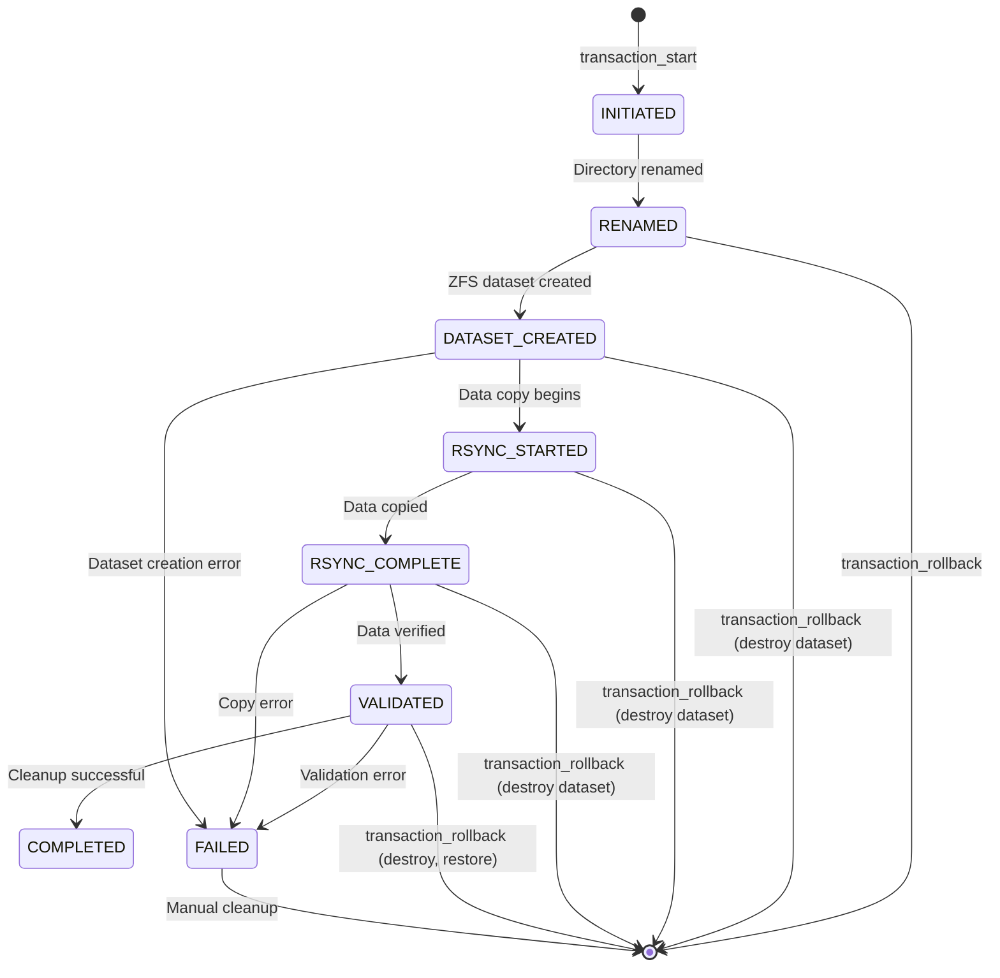

# Shared Library Architecture

The ZFS management scripts use a comprehensive shared library system organized under `/lib/`, providing common operations, validation, error handling, race condition prevention, and transaction management.

## Library Overview

| Library | Purpose | Key Functions | Used By |
|---------|---------|---------------|---------|
| [zfs-common.sh](#zfs-commonsh) | Common shared operations | Logging, notifications, ZFS helpers | All scripts |
| [zfs-validation.sh](#zfs-validationsh) | Input validation | Path, URL, dataset validation | All scripts |
| [zfs-error-handling.sh](#zfs-error-handlingsh) | Error handling & recovery | Error tracking, cleanup | Auto-datasets, recovery |
| [zfs-locking.sh](#zfs-lockingsh) | Race condition prevention | Advisory locks, timeout management | Auto-datasets |
| [zfs-transactions.sh](#zfs-transactionssh) | Transactional operations | State tracking, rollback | Auto-datasets, recovery |

All libraries are sourced from `zfs-config.sh` before the main script execution begins.

## zfs-common.sh

**Purpose**: Common functions shared across all ZFS management scripts

### Logging Functions

**log_message** - Log with timestamp to file and stdout
```bash
log_message "INFO" "Script started"
log_message "ERROR" "Operation failed"
log_message "WARNING" "Low disk space"
log_message "SUCCESS" "Conversion completed"
```

**rotate_log** - Automatic log rotation when size exceeds limit
```bash
# Uses LOG_FILE, LOG_MAX_SIZE, LOG_MAX_FILES from config
rotate_log  # Rotates if LOG_FILE > LOG_MAX_SIZE
```

### Notification Functions

**send_notification** - Send Gotify notifications
```bash
send_notification "Message" "success|error|info"
```

Requires `GOTIFY_SERVER_URL` and `GOTIFY_APP_TOKEN` in configuration.

### ZFS Helper Functions

**is_zfs_dataset** - Check if path is a mounted ZFS dataset
```bash
if is_zfs_dataset "/mnt/tank/data"; then
    echo "Path is a ZFS dataset"
fi
```

**get_dataset_for_path** - Get dataset name for a given path
```bash
dataset=$(get_dataset_for_path "/mnt/tank/data")
# Returns: "tank/data"
```

**get_dataset_available_space** - Get available space for dataset
```bash
available=$(get_dataset_available_space "tank/data")
# Returns space in bytes
```

**get_dataset_used_space** - Get used space for dataset
```bash
used=$(get_dataset_used_space "tank/data")
# Returns used bytes
```

### Utility Functions

**require_root** - Check if running as root
```bash
if ! require_root; then
    echo "Must run as root"
    exit 1
fi
```

**ensure_directory** - Create directory with parents
```bash
ensure_directory "/var/log/zfs" 755
```

**normalize_name** - Convert German umlauts to ASCII
```bash
normalized=$(normalize_name "Bücher")
# Returns: "Buecher"
```

**format_bytes** - Convert bytes to human-readable format
```bash
size=$(format_bytes 1073741824)
# Returns: "1.0G"
```

**parse_size_to_bytes** - Parse size string to bytes
```bash
bytes=$(parse_size_to_bytes "10M")
# Returns: 10485760
```

## zfs-validation.sh

**Purpose**: Input validation to prevent injection attacks and invalid operations

### Path Validation

**validate_path** - Prevent path traversal attacks
```bash
if ! validate_path "/mnt/tank/data"; then
    echo "Invalid path"
    exit 1
fi
```

Checks for:
- Path traversal sequences (`../`, `..\\`)
- Empty paths
- Null bytes

### URL Validation

**validate_url** - Validate URL format
```bash
if ! validate_url "https://gotify.example.com"; then
    echo "Invalid URL"
fi
```

### Dataset Name Validation

**validate_dataset_name** - Validate ZFS dataset names
```bash
if ! validate_dataset_name "tank/data"; then
    echo "Invalid dataset name"
fi
```

Ensures compliance with ZFS naming rules (no spaces, special chars, etc.)

### Other Validators

- **validate_positive_integer** - Ensure positive integer values
- **validate_non_negative_integer** - Ensure non-negative values
- **validate_integer_range** - Validate integer in range
- **validate_host** - Validate hostnames
- **validate_boolean** - Validate yes/no values
- **validate_choice** - Validate against allowed options

## zfs-error-handling.sh

**Purpose**: Error tracking, cleanup, and graceful error recovery

### Error Tracking

**track_error** - Record error occurrence
```bash
track_error "Dataset creation failed"
```

**get_error_count** - Get total error count
```bash
errors=$(get_error_count)
if [[ $errors -gt 0 ]]; then
    echo "Had $errors errors"
fi
```

### Cleanup Management

**cleanup_on_exit** - Exit trap for cleanup
```bash
# Register cleanup function
trap cleanup_on_exit EXIT

cleanup_on_exit() {
    # Releases locks, cleans temp files, etc.
}
```

**register_cleanup_callback** - Add custom cleanup action
```bash
register_cleanup_callback "rm -f /tmp/mytempfile"
```

## zfs-locking.sh

**Purpose**: Race condition prevention using `flock`-based advisory locking

### Lock Acquisition

**acquire_lock** - Acquire advisory lock with timeout
```bash
if acquire_lock "zfs-auto-datasets" 3600; then
    echo "Lock acquired, proceeding with operation"
else
    echo "Could not acquire lock (timeout or another process running)"
    exit 1
fi
```

**Parameters**:
- Lock name (becomes lockfile path)
- Timeout in seconds (0 = no timeout)

**Behavior**:
- Creates lockfile in `/var/lock/`
- Uses `flock` with exclusive (ex) mode
- Waits for timeout or until lock available
- Automatic cleanup on script exit

### Lock Release

**release_lock** - Release acquired lock
```bash
release_lock  # Removes lockfile
```

### Lock Query

**is_lock_held** - Check if lock is held
```bash
if is_lock_held "zfs-auto-datasets"; then
    echo "Another instance is running"
fi
```

### Race Conditions Prevented

The locking system prevents these race conditions:

1. **Docker Container State Changes** - Prevents concurrent start/stop operations on same containers
2. **VM Shutdown Race** - Prevents multiple processes trying to manage same VM
3. **Dataset Creation Race (TOCTOU)** - Prevents concurrent dataset creation for same path

See [LOCKING_STRATEGY.md](/LOCKING_STRATEGY.md) for detailed explanation.

## zfs-transactions.sh

**Purpose**: Transactional dataset operations with atomic rollback

### Transaction Lifecycle



### Transaction Functions

**transaction_start** - Begin new transaction
```bash
transaction_id=$(transaction_start "tank/data" "/mnt/tank/data")
```

**transaction_update_state** - Update transaction state
```bash
transaction_update_state "$transaction_id" "RENAMED"
```

**transaction_complete** - Mark transaction successful
```bash
transaction_complete "$transaction_id"
# Removes transaction record, cleans temp directory
```

**transaction_rollback** - Rollback transaction
```bash
transaction_rollback "$transaction_id"
# Restores original state based on current state
```

### Transaction State Storage

Transactions are stored in `/var/lib/zfs-auto-datasets/transactions/`:

```
/var/lib/zfs-auto-datasets/transactions/
├── 20250115_080000_tank_data/
│   ├── transaction.conf  # State metadata
│   ├── original_path     # Original source path
│   └── state             # Current state (RENAMED, COMPLETED, etc.)
```

### Forward Recovery

**transaction_forward_recovery** - Complete incomplete transaction
```bash
# For transactions stuck in VALIDATED state (data copied but not cleaned)
transaction_forward_recovery "$transaction_id"
# Completes cleanup without re-copying data
```

### Transaction State Query

**transaction_get_state** - Get current transaction state
```bash
state=$(transaction_get_state "$transaction_id")
```

**list_pending_transactions** - List all incomplete transactions
```bash
list_pending_transactions
```

## Integration Pattern

All libraries are sourced through `zfs-config.sh`:

```bash
# From zfs-config.sh
SCRIPT_DIR="$(cd "$(dirname "${BASH_SOURCE[0]}")" && pwd)"

# Source libraries in dependency order
source "$SCRIPT_DIR/lib/zfs-validation.sh"
source "$SCRIPT_DIR/lib/zfs-common.sh"
source "$SCRIPT_DIR/lib/zfs-error-handling.sh"
source "$SCRIPT_DIR/lib/zfs-locking.sh"
source "$SCRIPT_DIR/lib/zfs-transactions.sh"
```

Main scripts then source configuration:

```bash
# From zfs-auto-datasets-ubuntu.sh
source "$(dirname "$0")/zfs-config.sh"
```

## Documentation Files

Each library has detailed documentation:
- [lib/README.md](/lib/README.md) - Complete function reference
- [lib/ERROR_HANDLING.md](/lib/ERROR_HANDLING.md) - Error handling details
- [lib/TRANSACTIONS.md](/lib/TRANSACTIONS.md) - Transaction implementation
- [LOCKING_STRATEGY.md](/LOCKING_STRATEGY.md) - Locking design and rationale

## Source Files

- **[lib/zfs-common.sh](/lib/zfs-common.sh)** - Common operations
- **[lib/zfs-validation.sh](/lib/zfs-validation.sh)** - Input validation
- **[lib/zfs-error-handling.sh](/lib/zfs-error-handling.sh)** - Error handling
- **[lib/zfs-locking.sh](/lib/zfs-locking.sh)** - Race condition prevention
- **[lib/zfs-transactions.sh](/lib/zfs-transactions.sh)** - Transaction management

## Related Documentation

- [Auto Dataset Converter](../scripts/auto-datasets.md) - Uses all libraries
- [Recovery Procedures](../operations/recovery.md) - Transaction recovery operations
- [QUICKSTART_COMMON_LIBRARY.md](/QUICKSTART_COMMON_LIBRARY.md) - Developer quick start
