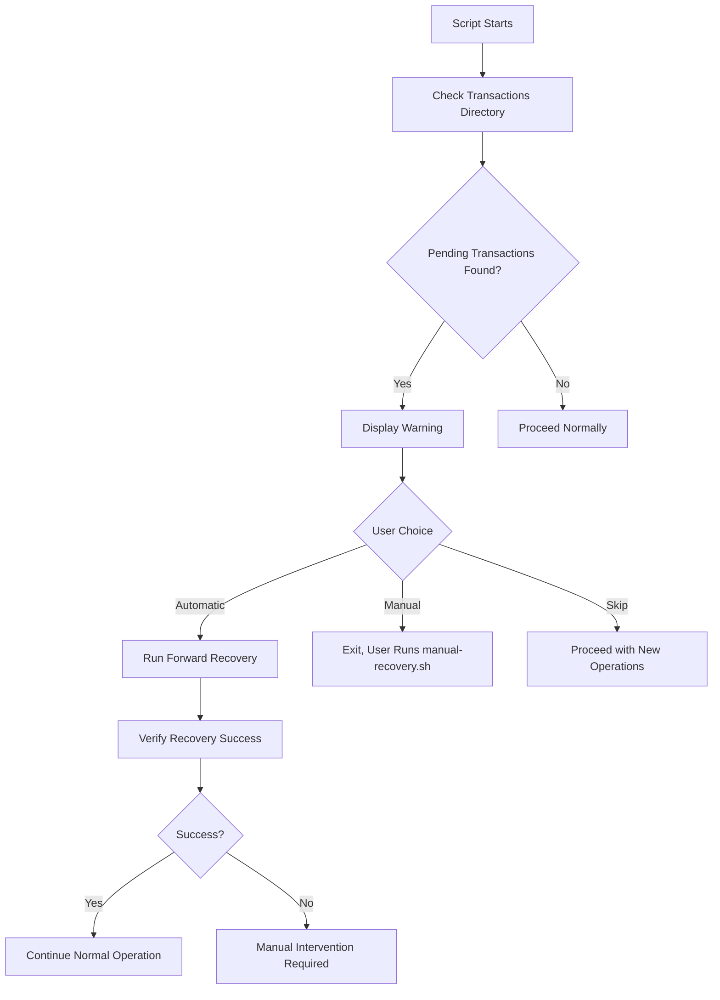

# Recovery and Rollback Procedures

This guide covers emergency recovery procedures for ZFS dataset conversions, including transaction recovery after power loss, script crashes, and manual rollback operations.

## Quick Reference

| Scenario | Command | Description |
|----------|---------|-------------|
| Automatic recovery | `sudo ./zfs-auto-datasets-ubuntu.sh` | Detects and completes pending transactions |
| List pending | `sudo ./manual-recovery.sh list` | Show all incomplete transactions |
| Show details | `sudo ./manual-recovery.sh show <id>` | Display transaction details |
| Manual rollback | `sudo ./manual-recovery.sh rollback <id>` | Rollback specific transaction |
| Forward recovery | `sudo ./manual-recovery.sh recover <id>` | Complete stuck transaction |

## Transaction States

| State | Meaning | Safe To | Rollback Action |
|-------|---------|---------|-----------------|
| INITIATED | Transaction started, no changes | Rollback or continue | No action needed |
| RENAMED | Source directory renamed to `_temp` | Rollback or continue | Rename `_temp` back to original |
| DATASET_CREATED | ZFS dataset created, no data | Rollback or continue | Destroy dataset, rename temp back |
| RSYNC_STARTED | Data copy in progress | Rollback (destroy) or wait | Destroy dataset, rename temp back |
| RSYNC_COMPLETE | Data copied, not validated | Rollback (destroy) or validate | Destroy dataset, rename temp back |
| VALIDATED | Data verified, cleanup pending | Rollback or forward recovery | Destroy dataset, restore from temp |
| COMPLETED | All operations successful | None | No action needed |
| FAILED | Error occurred | Manual review | Review logs, then rollback |

## Emergency Scenarios

### Scenario 1: Power Loss During Conversion

**Situation**: Power failed during rsync operation.

**Symptoms**:
- Script not running
- Dataset exists but may be incomplete
- Original data in `_temp` directory

**Recovery Steps**:

```bash
# 1. List pending transactions
sudo ./manual-recovery.sh list

# Output example:
# Pending transactions:
# 20250115_143022_tank_data - State: RSYNC_STARTED - Source: /mnt/tank/data

# 2. Check filesystem state
ls -la /mnt/tank/
# You'll see: data_temp (original) and data (ZFS dataset, incomplete)

# 3. Check transaction state
sudo ./manual-recovery.sh show 20250115_143022_tank_data

# 4. Decide: rollback or forward recovery
# If rsync didn't complete, rollback to original
sudo ./manual-recovery.sh rollback 20250115_143022_tank_data

# 5. Verify data integrity
ls -la /mnt/tank/data  # Should be restored original
```

**Result**: Original data restored, incomplete dataset destroyed.

### Scenario 2: Script Crash After Validation

**Situation**: Script crashed after data validation but before cleanup.

**Symptoms**:
- Transaction in VALIDATED state
- Both `data_temp` and `data` exist
- Data verified and complete

**Recovery Steps**:

```bash
# 1. List transactions
sudo ./manual-recovery.sh list

# 2. Show transaction details
sudo ./manual-recovery.sh show 20250115_143022_tank_data
# State: VALIDATED
# Source: /mnt/tank/data
# Dataset: tank/data
# Temp: /mnt/tank/data_temp

# 3. Forward recovery (complete the transaction)
sudo ./manual-recovery.sh recover 20250115_143022_tank_data
# This removes _temp, marks transaction COMPLETED

# 4. Verify
sudo ./manual-recovery.sh list  # Should be empty
ls -la /mnt/tank/  # Only 'data' should remain
```

**Result**: Transaction completed successfully, temp directory removed.

### Scenario 3: Multiple Failed Conversions

**Situation**: Script failed on multiple datasets due to space error.

**Symptoms**:
- Multiple transactions in FAILED state
- Datasets may exist or not (depending on failure point)

**Recovery Steps**:

```bash
# 1. List all pending transactions
sudo ./manual-recovery.sh list

# 2. Review each transaction
for id in $(sudo ./manual-recovery.sh list --ids-only); do
    echo "=== Transaction: $id ==="
    sudo ./manual-recovery.sh show "$id"
done

# 3. Rollback each failed transaction
for id in $(sudo ./manual-recovery.sh list --ids-only); do
    sudo ./manual-recovery.sh rollback "$id"
done

# 4. Address root cause (e.g., free space)
zfs list -o name,avail,used

# 5. Retry conversions with fixed configuration
sudo ./zfs-auto-datasets-ubuntu.sh
```

### Scenario 4: Zombie Transaction (Unknown State)

**Situation**: Transaction exists but state is unclear or corrupted.

**Symptoms**:
- Transaction record exists
- State file missing or corrupted
- Filesystem state unclear

**Recovery Steps**:

```bash
# 1. Inspect transaction directory
ls -la /var/lib/zfs-auto-datasets/transactions/
cd /var/lib/zfs-auto-datasets/transactions/20250115_143022_tank_data/

# 2. Read available metadata
cat transaction.conf 2>/dev/null || echo "No config"
cat state 2>/dev/null || echo "No state file"
cat original_path 2>/dev/null || echo "No path"

# 3. Inspect actual filesystem
original_path=$(cat original_path 2>/dev/null)
if [[ -d "${original_path}_temp" ]]; then
    echo "Original data in _temp"
fi
if [[ -d "$original_path" ]]; then
    echo "Dataset or directory exists"
fi

# 4. Manual decision based on evidence
# If _temp exists and data is incomplete:
# Manually restore: mv "${original_path}_temp" "$original_path"
# Then clean up transaction: rm -rf /var/lib/zfs-auto-datasets/transactions/20250115_143022_tank_data
```

## Manual Recovery Tool

### Usage

```bash
./manual-recovery.sh <command> [arguments]
```

### Commands

**list** - List all pending transactions
```bash
sudo ./manual-recovery.sh list
```

**show** - Show detailed transaction information
```bash
sudo ./manual-recovery.sh show <transaction_id>
```

**rollback** - Rollback transaction to original state
```bash
sudo ./manual-recovery.sh rollback <transaction_id>
```

**recover** - Complete transaction (forward recovery)
```bash
sudo ./manual-recovery.sh recover <transaction_id>
```

**help** - Show help message
```bash
sudo ./manual-recovery.sh help
```

### Transaction ID Format

```
YYYYMMDD_HHMMSS_<sanitized_dataset_name>

Example: 20250115_143022_tank_data
```

## Automatic Recovery Detection

The auto-dataset script automatically detects incomplete transactions on startup:



### Prompt on Detection

```
⚠️  WARNING: Pending transaction detected
Transaction ID: 20250115_143022_tank_data
State: VALIDATED
Source: /mnt/tank/data

Options:
1) Automatic forward recovery (complete transaction)
2) Manual recovery (exit and use manual-recovery.sh)
3) Skip (transaction remains pending)

Enter choice [1-3]:
```

## Rollback Behavior by State

### INITIATED → Rollback
- **Action**: None
- **Reason**: No changes made yet

### RENAMED → Rollback
- **Action**: `mv "${source}_temp" "$source"`
- **Effect**: Restores original directory name

### DATASET_CREATED → Rollback
- **Action**:
  1. `zfs destroy "$dataset"`
  2. `mv "${source}_temp" "$source"`
- **Effect**: Removes dataset, restores original

### RSYNC_STARTED → Rollback
- **Action**:
  1. Stop rsync if running
  2. `zfs destroy "$dataset"`
  3. `mv "${source}_temp" "$source"`
- **Effect**: Removes incomplete dataset, restores original

### RSYNC_COMPLETE → Rollback
- **Action**:
  1. `zfs destroy "$dataset"`
  2. `mv "${source}_temp" "$source"`
- **Effect**: Removes dataset (even with data), keeps original

### VALIDATED → Rollback
- **Action**:
  1. `zfs destroy "$dataset"`
  2. `mv "${source}_temp" "$source"`
- **Effect**: Removes verified dataset, uses original

### VALIDATED → Forward Recovery
- **Action**:
  1. Verify data integrity
  2. `rm -rf "${source}_temp"`
  3. Update state to COMPLETED
- **Effect**: Keeps new dataset, removes original backup

## Data Safety Checks

Before any rollback or recovery, the script:

1. **Verifies temp directory exists** (unless state is INITIATED)
2. **Checks dataset exists** (for states DATASET_CREATED and later)
3. **Validates state is合法** (known state string)
4. **Logs all actions** for audit trail
5. **Sends notification** on completion

```bash
# Example from lib/zfs-transactions.sh
if [[ "$state" == "VALIDATED" ]]; then
    if [[ ! -d "${source_path}_temp" ]]; then
        log_message "ERROR" "Temp directory missing, cannot rollback safely"
        exit 1
    fi
    # Proceed with rollback...
fi
```

## Prevention Best Practices

1. **Test with DRY_RUN="yes"** before production runs
2. **Monitor space** - Ensure adequate buffer before conversion
3. **Check logs** - Review `/var/log/zfs-auto-datasets.log` after runs
4. **Use notifications** - Configure Gotify for immediate error alerts
5. **Regular recovery testing** - Practice rollback procedures in test environment

## Source Files

- **[manual-recovery.sh](/manual-recovery.sh)** - Recovery tool implementation
- **[lib/zfs-transactions.sh](/lib/zfs-transactions.sh)** - Transaction system
- **[TRANSACTION_QUICKREF.md](/TRANSACTION_QUICKREF.md)** - Quick reference card
- **[lib/TRANSACTIONS.md](/lib/TRANSACTIONS.md)** - Detailed transaction documentation

## Related Documentation

- [Auto Dataset Converter](../scripts/auto-datasets.md) - Main conversion workflow
- [Library Overview](../libraries/overview.md#zfs-transactionssh) - Transaction system architecture
