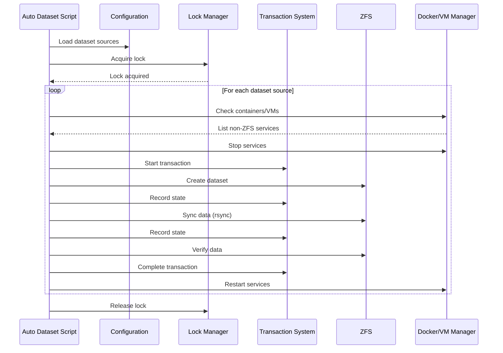

# Auto Dataset Converter

The ZFS Auto Dataset Converter automatically converts regular directories to ZFS datasets while preserving data, ensuring safety through transactions, and intelligently managing Docker containers and VMs.

## What It Does

The converter processes directories and transforms them into ZFS datasets, which provides benefits like:
- Native ZFS snapshots and compression
- Better space management and quotas
- Improved data integrity with ZFS checksums
- More efficient backup and replication

## How It Works

### Conversion Workflow



### Processing Steps

1. **Configuration Loading** - Reads `SOURCE_DATASETS_ARRAY`, Docker/VM settings from `zfs-config.sh`
2. **Lock Acquisition** - Prevents concurrent operations using `flock`-based locking
3. **Service Detection** - Identifies Docker containers and VMs not already on ZFS datasets
4. **Service Stop** - Gracefully stops detected services
5. **Transaction Start** - Initiates transaction state tracking
6. **Directory Rename** - Renames source directory to `_temp` suffix
7. **Dataset Creation** - Creates ZFS dataset with appropriate mount point
8. **Data Synchronization** - Uses `rsync -aHAX` to copy data with permissions
9. **Data Validation** - Verifies copy integrity and completeness
10. **Transaction Complete** - Marks transaction as successful, cleans up temp directory
11. **Service Restart** - Restarts Docker containers and VMs
12. **Lock Release** - Releases advisory lock

### Transaction States

Each conversion follows these states (see [operations/recovery.md](../operations/recovery.md) for recovery procedures):

| State | Description | Rollback Action |
|-------|-------------|-----------------|
| INITIATED | Transaction started | No action needed |
| RENAMED | Source renamed to `_temp` | Rename back to original |
| DATASET_CREATED | ZFS dataset created | Destroy dataset, rename temp back |
| RSYNC_STARTED | Data copy in progress | Destroy dataset, rename temp back |
| RSYNC_COMPLETE | Data copied, pending validation | Destroy dataset, rename temp back |
| VALIDATED | Data verified, cleanup pending | Destroy dataset, restore from temp |
| COMPLETED | All operations successful | No rollback needed |

## Configuration

### Dataset Sources

Configure in `zfs-config.sh`:

```bash
# Docker appdata processing
SHOULD_PROCESS_CONTAINERS="yes"
SOURCE_POOL_APPDATA="tank"
SOURCE_DATASET_APPDATA="appdata"

# VM disk processing
SHOULD_PROCESS_VMS="yes"
SOURCE_POOL_VMS="tank"
SOURCE_DATASET_VMS="domains"
VM_FORCE_SHUTDOWN_WAIT="90"

# Custom datasets
SOURCE_DATASETS_ARRAY=(
    "tank/data"
    "backup/important"
)
```

### Safety Options

```bash
# Dry run mode (testing without changes)
DRY_RUN="yes"

# Space buffer (11% provides safety margin)
BUFFER_ZONE=11

# Cleanup temporary directories after success
CLEANUP_TEMP_DIRS="yes"

# Replace spaces with underscores in dataset names
REPLACE_SPACES="no"
```

## Service Management

### Docker Containers

The script intelligently handles Docker containers:

1. **Detection** - Uses `is_zfs_dataset` to check if container's data path is a ZFS dataset
2. **Filtering** - Only processes containers NOT already on ZFS datasets
3. **Graceful Stop** - Stops containers before conversion
4. **Restart** - Starts containers after successful conversion

```bash
# Example: Only processes containers with appdata not on ZFS
docker run -v /mnt/tank/appdata/plex:/config plex
# If /mnt/tank/appdata is NOT a ZFS dataset, container will be stopped
```

### Virtual Machines

VM handling follows a similar pattern with additional safety:

1. **Detection** - Checks VM disk paths against ZFS dataset status
2. **Graceful Shutdown** - Uses `virsh shutdown` with timeout
3. **Force Stop** - After timeout period (configurable, default 90s), uses `virsh destroy`
4. **Restart** - Starts VMs after successful conversion

## Data Safety Features

### Space Validation

Before conversion, the script validates available space:

```bash
required_space=$((source_size + (source_size * BUFFER_ZONE / 100)))
available_space=$(get_dataset_available_space "$pool")

if [[ $available_space -lt $required_space ]]; then
    log_message "ERROR" "Insufficient space"
    exit 1
fi
```

The default 11% buffer accounts for:
- ZFS metadata overhead (~1-2%)
- Temporary snapshot/clone overhead (~3-5%)
- File system metadata (~2-3%)
- Safety buffer (~3-5%)

### Data Verification

After `rsync`, the script validates:

```bash
# Check if files exist in destination
if [[ ! -d "$destination_path" ]]; then
    transaction_rollback
    exit 1
fi

# Verify directory content
file_count=$(find "$destination_path" -type f | wc -l)
if [[ $file_count -eq 0 ]]; then
    transaction_rollback
    exit 1
fi
```

### German Umlaut Normalization

Dataset names are normalized to ZFS-compatible ASCII:

```bash
normalize_name "Bücher"  # Returns "Buecher"
normalize_name "Äpfel"   # Returns "Aepfel"
```

## Dependencies

The auto-dataset converter depends on these [shared libraries](../libraries/overview.md):

- **zfs-common.sh** - Logging, notifications, ZFS helpers
- **zfs-validation.sh** - Path and dataset name validation
- **zfs-error-handling.sh** - Error tracking and cleanup
- **zfs-locking.sh** - Race condition prevention
- **zfs-transactions.sh** - Transaction state management

## Error Handling

### Conversion Failures

If conversion fails at any point:
1. Transaction is rolled back automatically
2. Original data is restored from `_temp` directory
3. Services are not restarted (manual intervention may be needed)
4. Error is logged and notification sent

### Partial States

If the script crashes (power loss, kill):
1. Transaction state is preserved in `/var/lib/zfs-auto-datasets/transactions/`
2. Next run detects incomplete transaction
3. User can run automatic or manual recovery via [recovery procedures](../operations/recovery.md)

## Source Files

- **Ubuntu version**: `/zfs-auto-datasets-ubuntu.sh` (recommended)
- **Unraid version**: `/zfs-auto-datasets.sh` (legacy)
- **Configuration**: `/zfs-config.sh`
- **Transaction integration**: `/lib/zfs-auto-datasets-transaction-integration.patch`

## Related Documentation

- [Recovery Procedures](../operations/recovery.md) - Transaction recovery and rollback
- [Library Overview](../libraries/overview.md) - Shared library architecture
- [Locking Strategy](../libraries/overview.md#locking) - Race condition prevention
