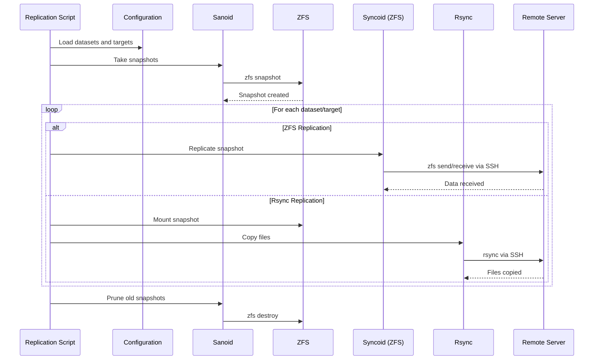

# Snapshot and Replication Manager

The ZFS Snapshot and Replication Manager automates dataset snapshot creation, retention policies, and data replication to local or remote destinations using both ZFS-native (syncoid) and rsync methods.

## What It Does

This script handles:
- **Automated Snapshots** - Creates and manages ZFS snapshots using Sanoid policies
- **Flexible Replication** - Supports both ZFS-to-ZFS (syncoid) and rsync replication
- **Remote Support** - Replicates to remote servers via SSH
- **Retention Management** - Configurable snapshot retention policies
- **Dataset Selection** - Auto-select datasets or manually specify targets

## How It Works

### Replication Workflow



### Processing Steps

1. **Configuration Loading** - Reads datasets, targets, and retention policies from `zfs-config.sh`
2. **Dataset Selection** - Either auto-selects from pool or uses manual list
3. **Snapshot Creation** - Invokes Sanoid to create snapshots per retention policy
4. **Replication Execution** - For each dataset and target:
   - **ZFS Mode**: Uses syncoid for efficient ZFS send/receive
   - **Rsync Mode**: Mounts snapshot, uses rsync for file-level copy
5. **Snapshot Pruning** - Sanoid removes snapshots exceeding retention policy
6. **Cleanup** - Unmounts temporary snapshots, sends notifications

## Configuration

### Dataset Selection

Configure in `zfs-config.sh`:

```bash
# Auto-select all datasets in pool
SOURCE_DATASET_AUTO_SELECT="yes"
SOURCE_DATASET_AUTO_SELECT_EXCLUDE_PREFIX="backup_"

# Manual dataset list
SOURCE_DATASETS_ARRAY=(
    "tank/data/documents"
    "tank/data/photos"
)
```

### Snapshot Retention

Sanoid-based retention policies:

```bash
AUTO_SNAPSHOTS="yes"
SNAPSHOT_HOURS="0"      # Hourly snapshots to keep
SNAPSHOT_DAYS="7"        # Daily snapshots to keep
SNAPSHOT_WEEKS="4"       # Weekly snapshots to keep
SNAPSHOT_MONTHS="3"      # Monthly snapshots to keep
```

### Replication Targets

Configure local and remote targets:

```bash
# Primary replication target
REPLICATION_TARGET_POOL="backup"
REPLICATION_TARGET_HOST="user@remote-server"
REPLICATION_TARGET_PATH="/mnt/backup/tank"

# Fallback rsync target
RSYNC_TARGET_HOST="user@backup-server"
RSYNC_TARGET_PATH="/backup/tank"
```

### Replication Method

Choose replication strategy:

```bash
REPLICATION_METHOD="syncoid"  # Options: syncoid, rsync, both
```

**Methods Explained**:
- **syncoid** - ZFS-native, uses `zfs send | zfs receive`, most efficient, requires ZFS on target
- **rsync** - File-level copy, works with any filesystem, slower but more flexible
- **both** - Tries syncoid first, falls back to rsync on failure

## Replication Methods

### ZFS Replication (syncoid)

**Advantages**:
- Efficient - Only sends changed blocks
- Fast - Incremental transfers
- Preserves all ZFS properties
- Compression support during transfer

**Requirements**:
- ZFS on source and destination
- SSH access to remote server
- Sufficient pool space on target

**Example**:
```bash
# syncoid command executed by script
syncoid -r --recv-options="u" tank/data backup@remote-server:backup/tank_data
```

### Rsync Replication

**Advantages**:
- Works with any destination filesystem
- No ZFS required on target
- Can replicate to non-ZFS storage

**Disadvantages**:
- Slower - File-level copying
- No ZFS property preservation
- Requires more bandwidth for full transfers

**Example**:
```bash
# rsync command executed by script
rsync -aHAX --delete /mnt/tank/data/.zfs/snapshot/latest/ \
    user@remote-server:/backup/tank_data/
```

## Remote Replication

### SSH Configuration

Remote replication requires SSH key-based authentication:

```bash
# On source server
ssh-keygen -t ed25519
ssh-copy-id user@remote-server

# Test connection
ssh user@remote-server zfs list
```

### SSH Fingerprint Verification

The script uses SSH fingerprint verification via `zfs-common.sh`:

```bash
# From lib/zfs-common.sh
verify_ssh_fingerprint() {
    local host="$1"
    local expected_fingerprint="$2"
    # Validates SSH host key before connection
}
```

This prevents man-in-the-middle attacks during replication.

## Snapshot Management

### Sanoid Integration

Sanoid handles snapshot creation and pruning:

```bash
# Sanoid configuration (typically /etc/sanoid/sanoid.conf)
[tank]
    hourly = 0
    daily = 7
    weekly = 4
    monthly = 3
    yearly = 0

# The script invokes: sanoid --take-snapshots --prune
```

### Snapshot Naming

Snapshots use timestamp-based naming:

```
tank/data@autosnap_2025-01-15_080000_hourly
tank/data@autosnap_2025-01-15_000000_daily
tank/data@autosnap_2025-01-12_000000_weekly
```

### Manual Snapshots

Users can create manual snapshots outside the automated schedule:

```bash
zfs snapshot tank/data@manual_$(date +%Y%m%d)
```

These are not pruned by Sanoid unless explicitly configured.

## Service Integration

### Docker and VM Awareness

The replication script is aware of Docker containers and VMs but doesn't stop them during snapshot/replication (unlike the auto-dataset converter). ZFS snapshots are instant and consistent.

### Gotify Notifications

Replication status notifications:

```bash
# Success
send_notification "Replication completed: 5 datasets, 2.3GB transferred" "success"

# Failure
send_notification "Replication failed: tank/data - connection timeout" "error"
```

## Safety Features

### Space Validation

Before replication, the script checks target space:

```bash
available=$(get_dataset_available_space "$target_pool")
required=$(get_dataset_used_space "$source_dataset")

if [[ $available -lt $required ]]; then
    log_message "ERROR" "Insufficient space on target"
    exit 1
fi
```

### Dry Run Mode

Test replication configuration without actual transfers:

```bash
# In zfs-config.sh
DRY_RUN="yes"

# Script will simulate operations but not transfer data
```

### SSH Key Validation

Prevents replication to unverified hosts:

```bash
# Checks known_hosts or configured fingerprint
verify_ssh_fingerprint "$target_host" "$expected_fingerprint"
```

## Dependencies

The replication manager depends on these [shared libraries](../libraries/overview.md):

- **zfs-common.sh** - Logging, notifications, SSH fingerprint verification
- **zfs-validation.sh** - Host and path validation
- **zfs-error-handling.sh** - Error tracking and cleanup

External dependencies:
- **Sanoid** - Snapshot management (`sudo apt install sanoid`)
- **syncoid** - ZFS replication (included with sanoid)
- **rsync** - File-based replication (usually pre-installed)
- **SSH client** - For remote replication

## Troubleshooting

### Common Issues

**Replication fails with "connection refused"**
- Check SSH connectivity: `ssh user@remote-server`
- Verify SSH key authentication
- Check firewall rules on target

**"Insufficient space" error**
- Check target pool: `zfs list -o name,avail,used`
- Free space or reduce retention policy
- Consider compression on target

**Snapshots not being created**
- Verify Sanoid configuration: `cat /etc/sanoid/sanoid.conf`
- Check Sanoid logs: `journalctl -u sanoid`
- Ensure `AUTO_SNAPSHOTS="yes"` in config

**Slow rsync performance**
- Use ZFS-to-ZFS replication (syncoid) instead
- Check network bandwidth
- Reduce dataset size or split into smaller datasets

## Source Files

- **Ubuntu version**: `/zfs-replications-ubuntu.sh` (recommended)
- **Unraid version**: `/zfs-dataset-replications.sh` (legacy)
- **Configuration**: `/zfs-config.sh`

## Related Documentation

- [Library Overview](../libraries/overview.md) - Shared library architecture
- [Testing Strategy](../development/testing.md) - Test procedures
- [README.md](/README.md) - Detailed user documentation
